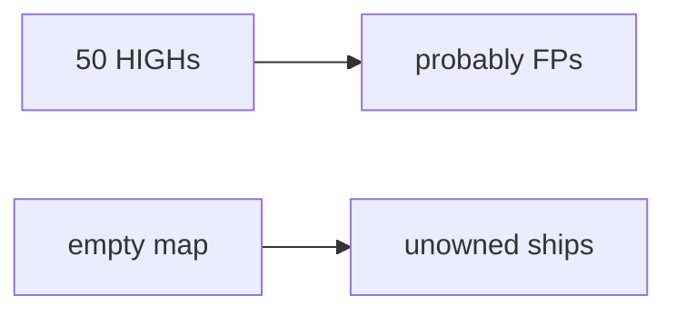

# 9.4-LO-07 — Transfer: clinic 50 unmapped HIGHs

**Kind:** transfer-challenge
**Loop step:** 7 Transfer
**Standards:** OWASP ASVS 5.0.0 (final) `v5.0.0-15.2.1`. SAMM 2.0 as vocabulary. SSDF 1.2 IPD remains **draft**.

## Change the workplace; keep unmapped HIGH from shipping

Do not answer with a Top 10 / CWE / scanner as the definition of security.

**Prompt:** Clinic: 50 unmapped HIGHs. Also name SCA CVE vs actually called function.

**Product sketch:** EHR-lite “code scanning is on and the dashboard is noisy so we ship Fridays,” plus a SAMM score.

Rewrite the SecureCollab sentence. Include:

1. attacker capabilities (alert fatigue — not a live clinic);
2. trust assumptions (mapping predicate is TCB; dashboard and SAMM are not);
3. forbidden outcome (`ship_ok([HIGH], {})` true, not “HIPAA”);
4. a test idea on a **local** fixture only (no live GHAS);
5. residual (authz blind spots, `v5.0.0-15.2.4` Level 3, mass suppressions);
6. WCAG if a human triage path exists (why F1 is blocked).

## Mental model: noise is not a map

## What graders reject

| Reject | Why |
|---|---|
| “scanner is on” | Signal, not ownership |
| Live GitHub org / public SCA | Lab policy |
| “SAMM Level 3” as ship_ok | Measurement, not the predicate |

## Practice

One page. No keys. `labs/9.4/9.4-lab` is the only running system you may break.
