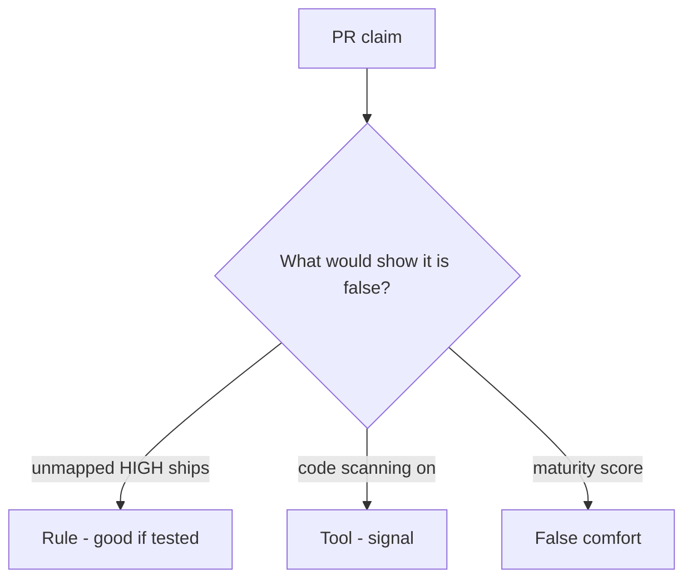

# Review always-true ship_ok like a pull request

**Kind:** code-review
**Loop step:** Review

Intended findings live only in the answer-key folder — not here. Do not open that file until your review has been evaluated.

## What you are reviewing

A colleague ships the notes app’s ship gate. Review `labs/9.4/9.4-lab/vulnerable/` as that change. Your job is not to count suspicious lines. Reconstruct whether `ship_ok([HIGH], {})` still returns true, compare that with the rule, and write changes a developer can verify.

Start at `ship_ok` and the HIGH×map row, not at a scanner color or a dashboard screenshot. The check you already ran (`test_unmapped_high_blocks_ship`) is the rule test. A comment “will map later” is not.

## Picture: ship_ok true on unmapped HIGH

Start with this seeded smell: **`ship_ok` true on unmapped HIGH**. Label it rule, tool, or false comfort before you accept the change.

Classification starts at the protected effect (unmapped HIGH denied). Everything that is not a join to the coverage map at that call is a candidate always-ship path. A scanner screenshot without that pytest is the same smell, not a different finding class.

Who-is-allowed blind spots are review and isolation tests — name them, do not skip `test_unmapped_high_blocks_ship`. Do not claim the verification gate is done. Do not scan a live tenant to prove the finding.

## Seeded smells (label them yourself)

- `ship_ok` true on unmapped HIGH
- Suppressions without owner
- SAST offered as the verification gate
- No blind-spot note for who-is-allowed / IDOR

Also reject: live tenants; closing findings without re-running `test_unmapped_high_blocks_ship`; keys in learner notes; claiming the verification gate is done.

## Common mix-ups

- Zero findings means secure
- A scanner replaces the requirement list
- Reachability is optional theater
- A maturity score is `ship_ok`
- A draft supply-chain paper is finished

## Practice

Write three review notes a maintainer could act on. Each note: what you saw, rule or false comfort, suggested structural change, leftover you will **not** delete. Tie at least one note to `test_unmapped_high_blocks_ship`. Do not open the keys file.

## Use it somewhere new

Clinic change that “enabled code scanning” without a mapping check is an incomplete ship-gate review. Name the independent falsehood that would still keep unmapped HIGH from shipping.

## Can people still use it

The triage screen must say *why* F1 is blocked, in words. Do not encode “blocked” as color only.

## What this page is not doing

Do not merge by adding a comment “will map later.” That comment is leftover without an owner. Do not scan a public repo to prove the finding.
