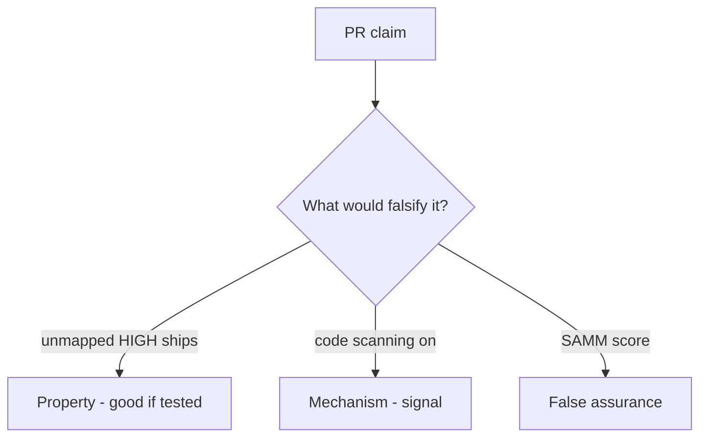

# 9.4-LO-08 — Review always-true ship_ok as a PR

**Kind:** code-review
**Loop step:** Review
**Standards:** OWASP ASVS 5.0.0 (final) `v5.0.0-15.2.1`. NIST SSDF 1.1 RV.1.

## Review the fixture as if it were SecureCollab’s ship gate

Review `labs/9.4/9.4-lab/vulnerable/` as a SecureCollab PR. Intended findings live only in `content/assessment/keys/9.4.md` — not here.

## Mental model: property, mechanism, or false assurance

Seeded smells (label them yourself; do not open the keys file):

- `ship_ok` true on unmapped HIGH
- Suppressions without owner
- SAST as Gate 9
- No blind-spot note for IDOR

Also reject: live tenants, keys in lessons, claiming Gate 9.

## Misconceptions

- Zero findings means secure
- Tool X replaces ASVS
- Reachability is optional theater

## Practice

Write three review notes. Tie at least one to `test_unmapped_high_blocks_ship`.

## Transfer

Clinic PR that “enabled code scanning” without a mapping predicate is incomplete.
