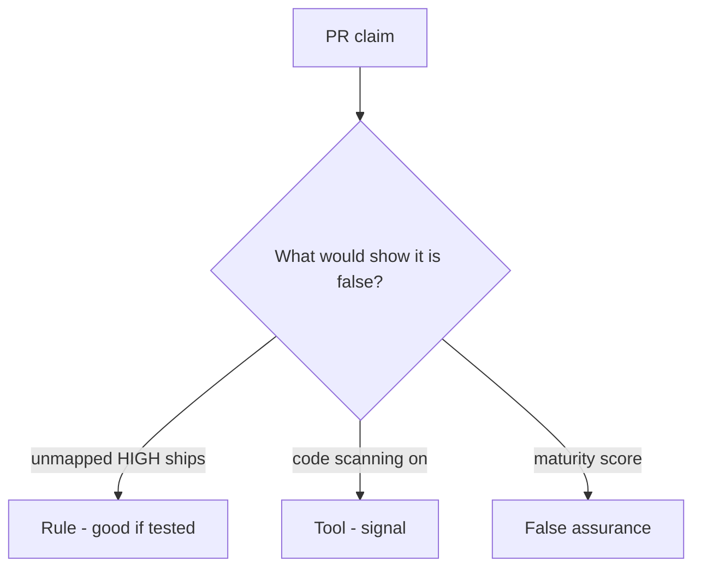

# Would you merge this always-true ship_ok?

**Kind:** code-review
**Loop step:** Review

Wait until someone has looked at your review before opening the keys.

## What you are reviewing

Review `labs/9.4/9.4-lab/vulnerable/` as a change to the notes app’s ship gate. Check whether `ship_ok([HIGH], {})` still returns true.

Start at `ship_ok` and the HIGH×map row, not at a scanner color or a dashboard screenshot. The check you already ran (`test_unmapped_high_blocks_ship`) is the rule test. A comment “will map later” is not.

## Picture: ship_ok true on unmapped HIGH

**`ship_ok` true on unmapped HIGH**.

An unmapped HIGH still has to be denied. If the change never joins to the coverage map, that always-ship leftover is still open. A scanner screenshot does not replace that check.

Who-is-allowed blind spots are review and isolation tests — name them, do not skip `test_unmapped_high_blocks_ship`. Do not claim the verification gate is done. Do not scan a live tenant to prove the finding.

## Problems to find (name them yourself)

- `ship_ok` true on unmapped HIGH
- Suppressions without owner
- SAST offered as the verification gate
- No blind-spot note for who-is-allowed / IDOR

Also reject: live tenants; closing findings without re-running `test_unmapped_high_blocks_ship`; keys in learner notes; claiming the verification gate is done.

## Common mix-ups

- Zero findings means secure
- A scanner replaces the requirement list
- Reachability is optional theater
- A maturity score is `ship_ok`
- A draft supply-chain paper is finished

## Practice

Write the review that blocks this change. Mention `test_unmapped_high_blocks_ship`.

## Use it somewhere new

Clinic change that “enabled code scanning” without a mapping check is an incomplete ship-gate review. Name the independent falsehood that would still keep unmapped HIGH from shipping.

## Can people still use it

The triage screen must say *why* F1 is blocked, in words. Do not encode “blocked” as color only.

## What this page is not doing

Do not merge by adding a comment “will map later.” That comment is leftover without an owner. Do not scan a public repo to prove the finding.
