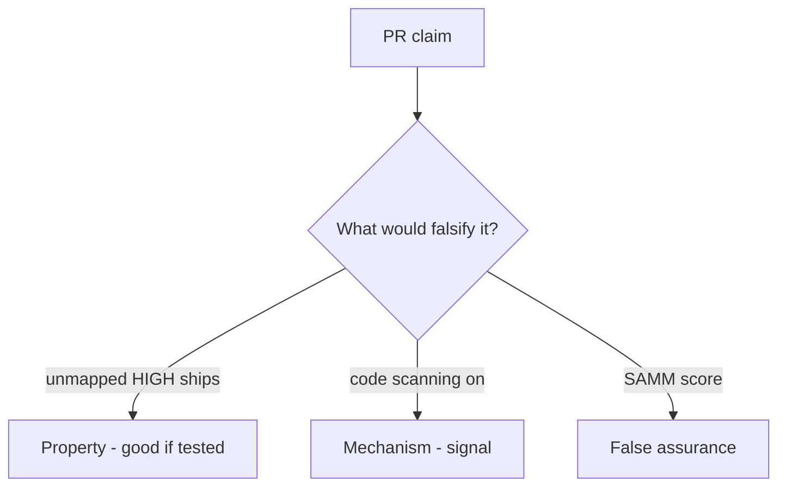

# 9.4-LO-08 — Review always-true ship_ok as a PR

**Kind:** code-review
**Loop step:** Review
**Standards:** OWASP ASVS 5.0.0 (final) `v5.0.0-15.2.1`. NIST SSDF 1.1 (final) RV.1.

## Review the fixture as if it were SecureCollab’s ship gate

Review `labs/9.4/9.4-lab/vulnerable/` as a SecureCollab PR. Your job is not to count suspicious lines. Reconstruct whether `ship_ok([HIGH], {})` still returns true, compare that with the module invariant, and write changes a developer can verify.

Intended findings live only in `content/assessment/keys/9.4.md` — not here. Do not open the keys file until your review has been evaluated.

## Mental model: ship_ok true on unmapped HIGH

Start with this seeded smell: **`ship_ok` true on unmapped HIGH**. Label it property, mechanism, or false assurance before you accept the PR.

Classification starts at the protected effect (unmapped HIGH denied). Everything that is not a join to 9.1 at that call is a candidate always-ship path. A scanner screenshot without that pytest is the same smell, not a different finding class.

Authz blind spots are 9.2 / 9.3 — name them, do not skip `test_unmapped_high_blocks_ship`. Do not claim Gate 9. Do not scan a live tenant to prove the finding.

## Seeded smells (label them yourself)

- `ship_ok` true on unmapped HIGH
- Suppressions without owner
- SAST as Gate 9
- No blind-spot note for IDOR

Also reject: live tenants; closing findings without re-running `test_unmapped_high_blocks_ship`; keys in lessons; claiming Gate 9.

## Misconceptions this module refuses

- Zero findings means secure
- Tool X replaces ASVS
- Reachability is optional theater
- SAMM score is `ship_ok`
- SSDF 1.2 IPD is final

## Practice

Write three review notes a maintainer could act on. Each note: observation, property or false assurance, suggested structural change, residual you will **not** delete. Tie at least one to `test_unmapped_high_blocks_ship`.

## Transfer

Clinic PR that “enabled code scanning” without a mapping predicate is an incomplete ship-gate review. Name the independent falsehood that would still keep unmapped HIGH from shipping.

## Non-goals

Do not merge by adding a comment “will map later.” That comment is a residual without an owner. Do not scan a public repo to prove the finding.
