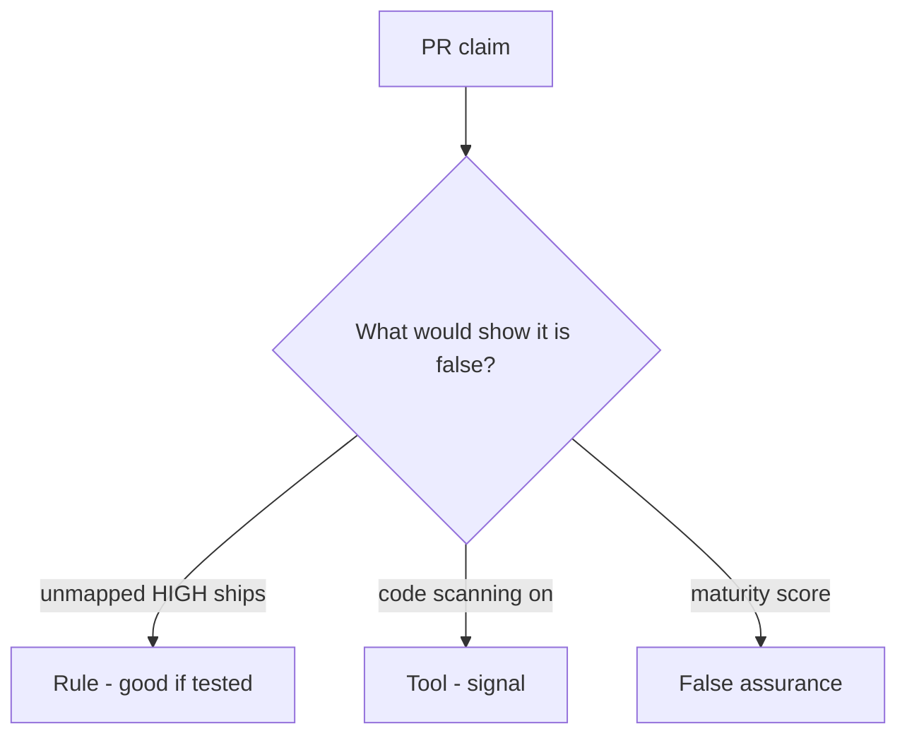

# Would you merge this always-true ship_ok?

**Kind:** code-review
**Loop step:** Review

## What you are reviewing

Read `labs/9.4/9.4-lab/vulnerable/` as the ship check. Does `ship_ok([HIGH], {})` still return true?

Read `ship_ok` and the HIGH×map row. A dashboard screenshot does not own the HIGH. A TODO to map later does not satisfy `test_unmapped_high_blocks_ship`.

## Picture: ship_ok true on unmapped HIGH

**`ship_ok` true on unmapped HIGH**.

An unmapped HIGH still has to be denied. If the change never joins to the coverage map, that always-ship leftover is still open. A scanner screenshot does not replace that check.

Who-is-allowed blind spots are review and isolation tests — name them, do not skip `test_unmapped_high_blocks_ship`. Do not treat this as a finished check-in. Do not scan a live tenant to prove the finding.

## Problems to find (name them yourself)

- `ship_ok` true on unmapped HIGH
- Suppressions without owner
- SAST offered as the check-in
- No blind-spot note for who-is-allowed / IDOR

Also reject: live tenants; closing findings without re-running `test_unmapped_high_blocks_ship`; keys in learner notes; treating this SCA lesson as a check-in.

## Common mix-ups

- Zero findings means secure
- A scanner replaces the requirement list
- Reachability is optional theater
- A maturity score is `ship_ok`
- A draft supply-chain paper is finished

## Use it somewhere new

Code scanning without a mapping check does not own the HIGH at ship. Code scanning is not a mapping check — write the unmapped-HIGH block.

## Can people still use it

The triage screen must say *why* F1 is blocked, in words. Do not encode “blocked” as color only.

## What this page is not doing

Leave “will map later” out of the ship until someone owns the unmapped HIGH. Do not scan a public repo to prove the finding.
