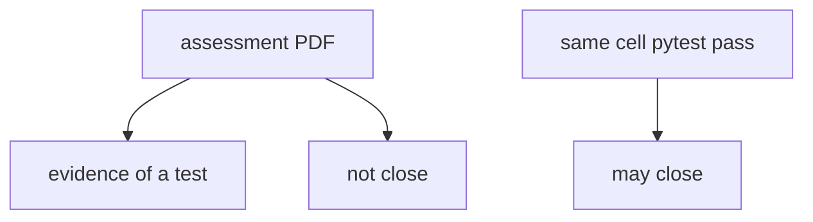
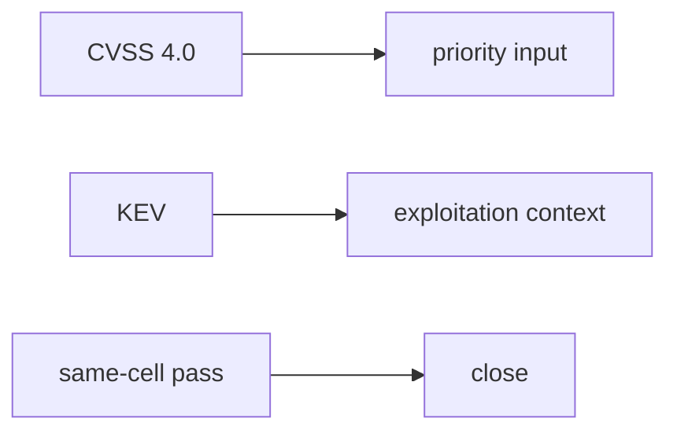

# 9.5-LO-01 — A PDF is not a retest

**Kind:** concept-model
**Loop step:** 1 Property
**Standards:** OWASP WSTG 4.2 (final) as catalogue. ASVS `v5.0.0-8.2.1`; `v5.0.0-8.3.2` is **Level 3, advanced**. FIRST CVSS 4.0 (final) as *input*. CISA KEV as **awareness** context. Scope: local lab only.

## The claim this module owns

SecureCollab may receive an authorized assessment of AUTHZ-1 (cross-tenant read). Closing the finding requires a **passing retest of that same forbidden outcome**. A PDF on a shelf, a Jira Done, or a CVSS number is not that predicate.

> `close_finding({"retest": None})` must be false. `close_finding({"retest": "pass"})` may be true.

The forbidden outcome is **finding closed without retest**. That is integrity of the fix loop — the hole can still be there.

WSTG 4.2 names *what* to try in an authorized web assessment; it does not close tickets. CVSS 4.0 Base/Threat/Environmental metrics inform priority; a 9.8 does not outsource judgment. KEV says whether exploitation is *observed in the wild* — useful context for an internal-only bug, not a license to scan public clinics. `v5.0.0-8.3.2` (immediate grant change) is **Level 3, advanced**: retest the *cache after role change*, not a different URL.

**Scope:** this course’s local fixture or official labs. Do not instruct attacks on public or third-party systems.

## Mental model: report vs retest



## Mental model: CVSS is an input



**Mechanism (not the property):** Jira Done, a pentest vendor logo, CVSS 9.8, KEV listing.

## Root cause vs impact vs prevention vs detection vs recovery

| Slice | For this property |
|---|---|
| Root cause | Closure on intent |
| Preconditions | `close_finding({retest: None})` true |
| Trigger | Ticket marked done after the PDF |
| Impact | Vulnerable still there; false residual |
| Prevention | Require retest of the same cell |
| Detection | `finding_closed_without_retest` |
| Recovery | Reopen; hunt variants |

## Framework defaults versus the close guarantee

Issue trackers have a Done state. That is not 9.3’s forbidden-outcome test.

## Mechanism limits

- Retest of a different endpoint.
- Variants of the same root cause (field grain 7.2).
- CVSS vs business priority still needs a human.

## Usability and accessibility

Reports used by engineers must be readable: structure cause/impact/retest, not color-only severity (WCAG 2.2 1.4.1).

## Practice

Write a three-line report: cause, impact, retest cmd. Then run:

```
python3 -m pytest labs/9.5/9.5-lab/tests --impl vulnerable
python3 -m pytest labs/9.5/9.5-lab/tests --impl fixed
```

The first command must fail. The second must pass.

## Transfer

KEV vs internal-only. Clinic pentest PDF shelf.

## Non-goals

Live-target pentests, real PII, weaponized copy-paste exploits. Gates 0–10 and M0–M5 stay **not-attempted**. Answer keys are not in this file.
