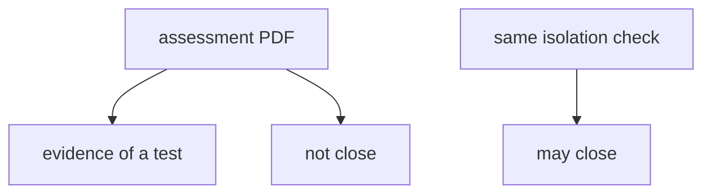
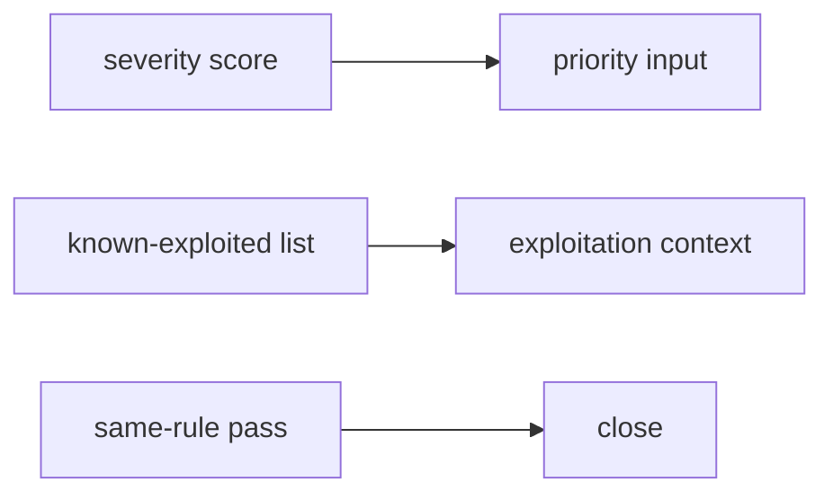

# A PDF is not a retest

**Kind:** concept-model
**Loop step:** 1 Property

## The rule

The notes app may get an authorized check of isolation: bob must not read alice's note. Closing that finding needs a **passing retest of that same bad result**. A PDF on a shelf, a ticket marked Done, or a severity number is not that check.

> `close_finding({"retest": None})` must be false. `close_finding({"retest": "pass"})` may be true.

Do not **close a finding without a retest**. That is honesty of the fix loop — the hole can still be there.

A testing-guide list names *what* an authorized web check may try. It does not close tickets. A severity score tells you how to rank work. A 9.8 does not make the close decision for you. A known-exploited list says whether someone has seen the bug used in the wild. That is useful context for an internal-only bug. It is not permission to scan a public clinic.

If you later require that a role change takes effect right away, retest the cache after the role change, not a different URL. That is extra, advanced work, not this check.

The practice is this course's local files or official labs. Do not tell anyone to try attacks on public or third-party systems.

## Picture: a report is not a retest



## Picture: a severity score is an input



A ticket marked Done, a vendor logo on a pentest PDF, a 9.8 severity, and a known-exploited listing do not prove a retest.

## People who can close without a retest

| Person | What they can do here | Motive | Harm if close ignores retest |
|---|---|---|---|
| Paper-compliance closer | Mark the ticket Done after the PDF lands | Look finished | Isolation hole stays; leftover looks closed |
| Severity-only triage | Treat 9.8 as the close decision | Rank and move on | Score is input, not a passing check |
| Someone who treats a known-exploited list as permission to scan | Point a scanner at a public clinic | "It's on the list" | Out of scope; still no local retest |

A Done ticket, a severity score, and a known-exploited listing already close the finding without a retest.

## Why it happens, what it costs, how you stop it, how you notice, how you recover

Someone closed on intent. That's the close-on-intent. The remaining isolation hole is what's still open.

| Slice | For this rule |
|---|---|
| Why it happens | Close looks at intent (PDF, ticket Done) |
| What's already wrong | `close_finding({retest: None})` is true |
| Trigger | Ticket marked Done after the PDF |
| What it costs | Vulnerable still there; leftover looks closed |
| How you stop it | Require a retest of the same rule |
| How you notice | `finding_closed_without_retest` |
| How you recover | Reopen; hunt variants of the same cause |

## What the framework does vs what you still have to check

Issue trackers have a Done state. That is a workflow default. It is not a passing retest of "bob must not read alice's note."

`close_finding({"retest": None})` is false — files in `labs/9.5/9.5-lab`. Fake data only. No live clinics. No real people's notes.

## What the tool cannot do

- A retest of a different endpoint (`/health` 200 is not isolation).
- Variants of the same root cause (extra fields on the note).
- Severity vs business priority still needs a human.
- A role-change cache that still serves the old grant. That is extra work, not this check.

## Can people still use it

Reports that engineers read must be readable: cause, impact, retest command. Do not encode severity as color only.

## Practice

Write a three-line report: cause, impact, retest command. Then run:

```text
python3 -m pytest labs/9.5/9.5-lab/tests --impl vulnerable
python3 -m pytest labs/9.5/9.5-lab/tests --impl fixed
```

## Use it somewhere new

Known-exploited list vs an internal-only bug. Clinic pentest PDF on a shelf.

## What this page is not doing

Do not try live-target pentests, real people's data, copy-paste exploits. This page does not mark you as finished. Answer keys are not on this site.
