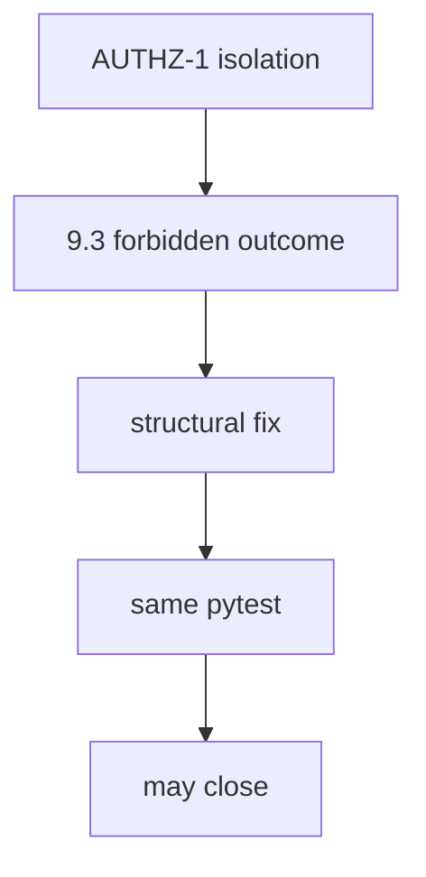
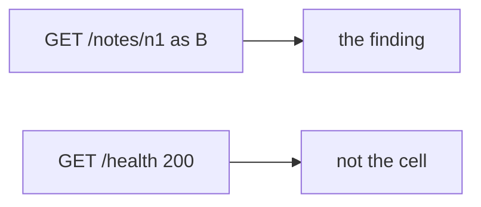

# 9.5-LO-02 — Same forbidden outcome, same cell

**Kind:** design-exercise
**Loop step:** 2 Model
**Standards:** OWASP WSTG 4.2 (final). ASVS `v5.0.0-8.2.1`. FIRST CVSS 4.0 as input.

## Can a second engineer name the retest from your report?

“We delivered a PDF” is not this lesson. A reviewable model names **the cell, the forbidden outcome, the retest command, and variants**.

SecureCollab freeze: local `close_finding(f)`. No live clinics.

## Mental model: same cell

## Mental model: different URL is not a retest

## Step 1: freeze pieces

| Piece | This system |
|---|---|
| Subjects | paper-compliance closer; ignored variants |
| Objects | finding; retest record |
| Actions | `close_finding` |
| Channels | ticket + CI |
| TCB | same-cell retest |
| Untrusted | PDF; CVSS; Jira Done; KEV as a close |
| State / time | after fix; variant hunt |
| 1.1 cell | integrity of the fix loop |

## Step 2: write cells

| Subject | Object | Action | Decision |
|---|---|---|---|
| retest None | finding | close | deny |
| retest pass | finding | close | may allow |
| CVSS 9.8 | finding | close | deny |
| different endpoint | finding | treat as retest | deny |

## Practice

Draw the loop. Point at `labs/9.5/9.5-lab` file `pentest.py`.

## Transfer

KEV: an exploited-in-the-wild CVE still needs a *local* retest if it maps to your cell.

## Residual risk

Unknown variants; Level 3 `v5.0.0-8.3.2` caches.

## Non-goals

Top 10 as the definition of security. Keys stay out of lessons.
