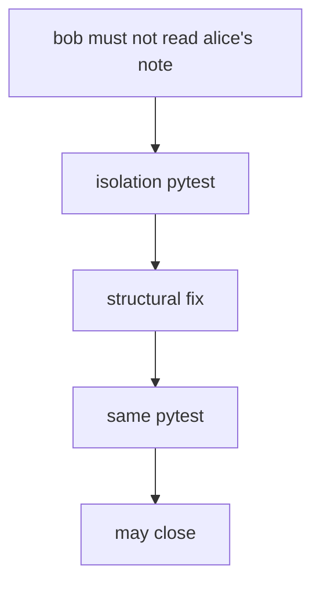
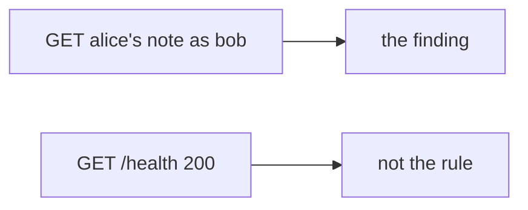

# Same bad result, same rule

**Kind:** design-exercise
**Loop step:** 2 Model

## Could someone else name the retest from your report?

"We delivered a PDF" is not this lesson. A drawing someone else can test names **the rule, what must not happen, the retest command, and variants**.

This week's freeze for the notes app: local `close_finding(f)`. No live clinics.

> For close, the rule is deny when `retest` is missing. A passing retest of the same isolation check may close. Evidence that the deny is false: `close_finding({"retest": None})` returns true.

If the rule × retest row is blank, the finding closes because nobody named the check.

## Picture: same rule

## Picture: a different URL is not a retest

A health check that returns 200 is a product test. It is not the isolation check you claimed to retest.

## Step 1: name the pieces

Do not invent a new catalogue. Take the finding you already have and ask what would show the hole is still there.

| Piece | This system |
|---|---|
| Who | Paper-compliance closer; someone who ignores variants |
| What | Finding; retest record |
| Actions | `close_finding` |
| Paths | Ticket plus CI |
| What you trust for this journey | Same-rule retest |
| What you do not trust | PDF; severity score; ticket Done; known-exploited list as a close |
| Time | After the fix; then hunt variants |
| The rule | Honesty of the fix loop |

## Step 2: write allow and deny

| Who | What | Action | Decision |
|---|---|---|---|
| closer | finding with retest None | close | deny |
| closer | finding with retest pass | close | may allow |
| severity 9.8 | finding | close | deny |
| different endpoint | finding | treat as retest | deny |

A missing retest field is how a PDF on a shelf becomes "Done." Write the hole.

## Practice

Draw the loop so someone else could name the checks. Point at `labs/9.5/9.5-lab` file `pentest.py`.

## Use it somewhere new

Known-exploited list: a bug seen in the wild still needs a *local* retest if it maps to your rule.

## What can still go wrong

Unknown variants. A role-change cache that still serves the old grant. That leftover is extra, advanced work, not this week's check.

## What this page is not doing

Answer keys are not on this site.
