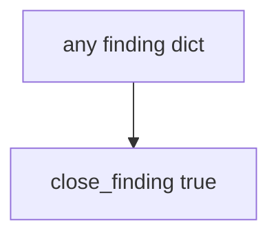

# Practice: always-true close_finding

**Kind:** mechanism-lab
**Loop step:** 3 Break

## Try it

The practice is not a website you attack. It is a tiny Python `close_finding` that returns true for every dict. The failure is already in the function: it never looks at `retest`. That always-true close is a **failed rule**, not a paperwork nit.

The rule under test:

> A finding must not close without a passing retest of the same bad result. If `close_finding({"retest": None})` returns true, the close gate has failed as a security control.

## Where you may practice

Only `labs/9.5/9.5-lab` is in scope. The practice is an in-process `close_finding(f)`. The finding is a synthetic dict. Do **not** scan, exploit, or "verify" any public or third-party system.

Do not paste this exercise onto a public clinic, employer tracker, or live hospital portal "to see what happens."

What is supposed to stop this: `close_finding` is supposed to require a **passing retest of the same isolation check** — bob must not read alice's note. A PDF, a ticket marked Done, a severity score, and a known-exploited listing are not enough.

Who can close without a retest in this story: a paper-compliance closer. That stands in for "the assessor delivered a 40-page PDF so we marked isolation Done," a 9.8 treated as the close decision, or a known-exploited listing used as a licence to scan a hospital portal.

## Picture: intent is enough



The broken files take that path on purpose. You do not need a testing catalogue. You must not pentest a public host. The true return for `{retest: None}` *is* the leak.

The isolation lesson already said HTTP 200 is not a security test. This check is **the same isolation check must pass before close**.

## What to look at — cause, not a dump

Read `vulnerable/pentest.py`. It returns true for every dict. Tests:

- `test_cannot_close_without_retest`
- `test_passing_retest_may_close` — `{retest: "pass"}` may pass on both

You do not need a new finding key. The failure of `test_cannot_close_without_retest` *is* the evidence.

Do not open the repaired files yet. Diagnose the cause first.

| What you see | What kind of failure | Not the lesson |
|---|---|---|
| `return True` for every dict | Close on intent; retest field ignored | "The PDF is the retest" |
| `{retest: None}` still closes | What must not happen is allowed | A severity score |
| No look at `"pass"` | The gate accepted a missing retest | A ticket marked Done |

## Why it happens vs what it costs

| Slice | Practice |
|---|---|
| The rule | `close_finding({retest: None})` is false |
| Why it happens | Closure on intent; retest field ignored |
| What has to be true first | `close_finding` true for every dict |
| Trigger | Ticket marked Done after the PDF lands |
| What it costs | Isolation hole remains; leftover looks closed |
| How you stop it later | Require `retest == "pass"`; missing, fail, or scheduled deny |
| How you notice later | `finding_closed_without_retest`; never note bodies |
| How you recover later | Reopen; run the same isolation check |
| Out of scope | A severity number; a live pentest; claiming an assurance gate |

A ticket tracker will show Done. A pentest vendor PDF is evidence that *someone tested once*. A severity score ranks work. The notes app's API will still serve the hole if the close gate is always true. The app's promise this week is: **this** practice, `retest` None is deny.

## Practice

From the repository root, in a throwaway environment:

```text
python3 -m pytest labs/9.5/9.5-lab/tests --impl vulnerable
```

Run from `labs/9.5/9.5-lab` if a collection at the repo root picks up `site/`. Record `test_cannot_close_without_retest`. Do not probe public hosts. A setup error is not proof the rule holds.

## Use it somewhere new

Clinic PDF on a shelf: predict without leaving this directory. Do not pentest a live clinic system.

## What this page is not doing

No live-target, weaponized, or copy-paste exploit instructions. Fake finding dicts only. This page does not mark you as finished. If you mention a newer testing-catalogue draft, say it is a draft.
