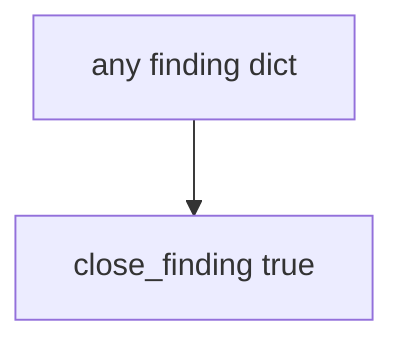

# Practice: always-true close_finding

**Kind:** mechanism-lab
**Loop step:** 3 Break

## Try it

The practice is not a website you attack. `close_finding` returns true for every dict: it never looks at `retest`, so a ticket can close without a retest.

> A finding must not close without a passing retest of the same bad result. If `close_finding({"retest": None})` returns true, the close gate has failed as a security control.

## Where you may practice

Stay inside `labs/9.5/9.5-lab`. The finding is a synthetic dict. Do **not** scan, exploit, or "verify" any public or third-party system.

Do not paste this exercise onto a public clinic, employer tracker, or live hospital portal "to see what happens."

`close_finding` is supposed to require a **passing retest of the same isolation check** — bob must not read alice's note. A PDF, a ticket marked Done, a severity score, and a known-exploited listing are not enough.

Picture a paper-compliance closer — "the assessor delivered a 40-page PDF so we marked isolation Done," a 9.8 treated as the close decision, or a known-exploited listing used as permission to scan a hospital portal.

## Picture: intent is enough



You do not need a testing-guide list. You must not pentest a public host. The true return for `{retest: None}` is already the leak.

The isolation lesson already said HTTP 200 is not a security test. This check is **the same isolation check must pass before close**.

## What to look at: the cause, not a hunt

`vulnerable/pentest.py` returns true for every dict. Tests:

- `test_cannot_close_without_retest`
- `test_passing_retest_may_close` — `{retest: "pass"}` may pass on both


| What you see | What kind of failure | Not the lesson |
|---|---|---|
| `return True` for every dict | Close on intent; retest field ignored | "The PDF is the retest" |
| `{retest: None}` still closes | What must not happen is allowed | A severity score |
| No look at `"pass"` | The gate accepted a missing retest | A ticket marked Done |

## Why it happens vs what it costs

| Slice | Practice |
|---|---|
| The rule | `close_finding({retest: None})` is false |
| Why it happens | Closure on intent; retest field ignored |
| What's already wrong | `close_finding` true for every dict |
| Trigger | Ticket marked Done after the PDF lands |
| What it costs | Isolation hole remains; leftover looks closed |
| How you stop it later | Require `retest == "pass"`; missing, fail, or scheduled deny |
| How you notice later | `finding_closed_without_retest`; never note bodies |
| How you recover later | Reopen; run the same isolation check |
| Out of scope | A severity number; a live pentest; claiming an assurance gate |

A ticket tracker will show Done. A pentest vendor PDF is evidence that *someone tested once*. A severity score ranks work. The notes app's API will still serve the hole if the close gate is always true. `retest` None is deny.

## Practice

```text
python3 -m pytest labs/9.5/9.5-lab/tests --impl vulnerable
```

Run from `labs/9.5/9.5-lab` if a collection at the repo root picks up `site/`. Do not probe public hosts. A setup error is not proof the rule holds.

## Use it somewhere new

Clinic PDF on a shelf: predict without leaving this directory. Do not pentest a live clinic system.

## What this page is not doing

No live-target, weaponized, or copy-paste exploit instructions. Fake finding dicts only. This page does not mark you as finished. If you mention a newer testing-guide draft, say it is a draft.
