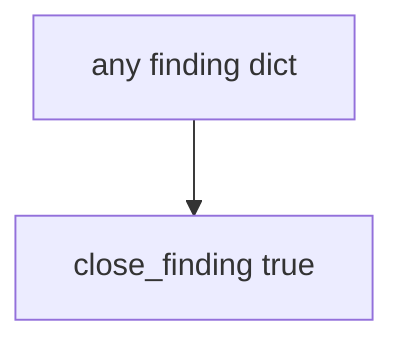

# 9.5-LO-03 — Observe always-true close, do not pentest public hosts

**Kind:** mechanism-lab
**Loop step:** 3 Break
**Standards:** OWASP WSTG 4.2 (final) as catalogue. Lab policy: local only.

## Authorized scope

`labs/9.5/9.5-lab` only. Synthetic finding dict. Do **not** scan, exploit, or “verify” any public or third-party system.

**Forbidden outcome:** Finding closed without retest.

## Mental model: intent is enough



The vulnerable tree demonstrates **cause** (closure on intent). Do not turn this into a live-target walkthrough.

## What to read in the fixture

`vulnerable/pentest.py` returns true for every dict. Tests require `close_finding({retest: None})` to be false.

## Root cause vs impact

| Slice | Lab |
|---|---|
| Root cause | Closure on intent |
| Impact | Hole remains; false residual |
| Not the lesson | A CVSS number as the definition |

## Practice

```
python3 -m pytest labs/9.5/9.5-lab/tests --impl vulnerable
```

Record `test_cannot_close_without_retest`. Do not probe public hosts.

## Transfer

Clinic PDF shelf: predict without leaving this directory.

## Non-goals

No live-target, weaponized, or copy-paste exploit instructions.
