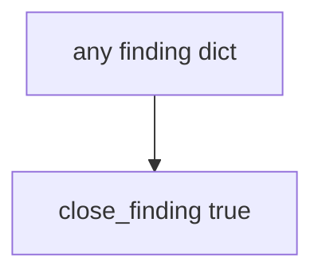

# 9.5-LO-03 — Observe always-true close, do not pentest public hosts

**Kind:** mechanism-lab
**Loop step:** 3 Break
**Standards:** OWASP WSTG 4.2 (final) as catalogue of *what* to retest. OWASP ASVS 5.0.0 (final) `v5.0.0-8.2.1`. `v5.0.0-8.3.2` grant-change cache is **Level 3, advanced**. FIRST CVSS 4.0 (final) as *input*. CISA KEV as **awareness**. WSTG 5.0 is **draft**. Lab policy: local only.

## Authorized scope

`labs/9.5/9.5-lab` only. The fixture is an in-process `close_finding(f)`. Synthetic finding dict. Do **not** scan, exploit, or “verify” any public or third-party system.

**Forbidden outcome:** Finding closed without retest. `close_finding({"retest": None})` returns true.

Attacker capability in this lab: a paper-compliance closer. That stands in for “the assessor delivered a 40-page PDF so we marked isolation Done,” a CVSS 9.8 treated as the close decision, or a KEV listing used as a license to scan a hospital portal. Trust assumption: `close_finding` is supposed to require a **passing retest of the same 9.3 forbidden outcome**. A PDF, Jira Done, CVSS, and KEV are not in the TCB for this cell.

## Mental model: intent is enough



The vulnerable tree demonstrates **cause** (closure on intent). Do not turn this into a live-target walkthrough. Preconditions: `close_finding` returns true for every dict. You do not need WSTG. You must not pentest a public host.

WSTG 4.2 names *what* an authorized web assessment may try. It does not close tickets. Module 9.3 already said HTTP 200 is not a security test; this cell is **the same isolation pytest must pass before close**. Gate 9 stays **not-attempted**.

## What to read in the fixture

`vulnerable/pentest.py` returns true for every dict. Tests:

- `test_cannot_close_without_retest`
- `test_passing_retest_may_close` — `{retest: "pass"}` may pass on both

You do not need a new finding key. The failure of `test_cannot_close_without_retest` *is* the evidence.

Do not open the fixed tree yet. Diagnose the cause first.

## Root cause vs impact vs prevention vs detection vs recovery

| Slice | This lab |
|---|---|
| Required property | `close_finding({retest: None})` is false |
| Root cause | Closure on intent; retest field ignored |
| Preconditions | `close_finding` true for every dict |
| Trigger | Ticket marked Done after the PDF lands |
| Impact | Isolation hole remains; residual looks closed |
| Prevention | Require `retest == "pass"`; missing/fail/scheduled deny |
| Detection | `finding_closed_without_retest`; never note bodies |
| Recovery | Reopen; run the same 9.3 isolation pytest |
| Not the lesson | A CVSS number; live pentest; Gate 9 complete |

## Framework defaults versus the close guarantee

Jira Done is a workflow default. A pentest vendor PDF is evidence that *someone tested once*. CVSS 4.0 ranks severity. FastAPI and Next.js will still serve the hole if the close gate is always true. The application guarantee is: **this** fixture, `retest` None is deny.

## Practice

```text
python3 -m pytest labs/9.5/9.5-lab/tests --impl vulnerable
```

Run from `labs/9.5/9.5-lab` if a repo-root collection picks up `site/`. Record `test_cannot_close_without_retest`. Do not probe public hosts. An environment error is not security evidence.

## Transfer

Clinic PDF shelf: predict without leaving this directory. Do not pentest a live EHR.

## Non-goals

No live-target, weaponized, or copy-paste exploit instructions. Do not claim Gate 9. WSTG 5.0 stays labeled draft if cited.
