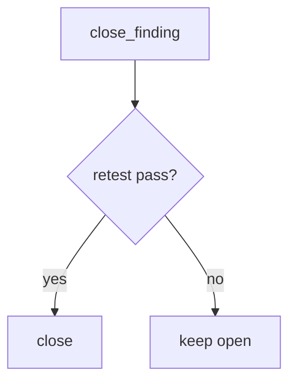

# 9.5-LO-04 — Require retest equals pass

**Kind:** design-exercise
**Loop step:** 4 Build
**Standards:** OWASP ASVS 5.0.0 (final) `v5.0.0-8.2.1`. NIST SSDF 1.1 RV.2.

## Structural means close looks at the retest field

`close_finding` must require `retest == "pass"`. Missing, `"fail"`, or `"scheduled"` is deny. That is the lab stand-in for “the same 9.3 command passed.”

## Mental model: fail closed



Do not accept a PDF attachment as `retest`.

## Why this restores the cell

| After the fix | Must be true |
|---|---|
| `{retest: None}` | close false |
| `{retest: "pass"}` | close true |

## What this is not

CVSS. KEV. Jira Done. Gate 9. A retest of `/health`.

## Practice

Name the residual (variants; wrong endpoint). Run:

```
python3 -m pytest labs/9.5/9.5-lab/tests --impl fixed
```

Must pass.

## Transfer

Clinic: keep the finding open until the isolation pytest is green.

## Residual risk

Same-root-cause variants (7.2 fields); `v5.0.0-8.3.2` Level 3 caches; exploratory leftovers.
