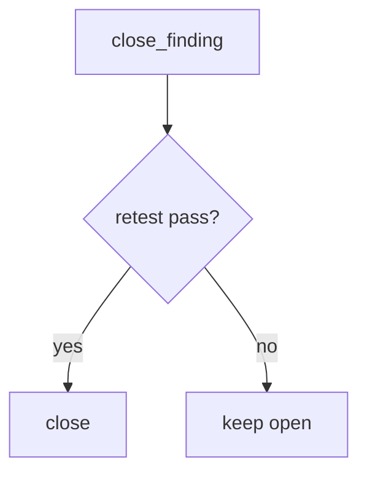

# Require retest equals pass

**Kind:** design-exercise
**Loop step:** 4 Build

## The rule

Attaching a PDF does not close the finding. Marking the ticket Done does not close it. Severity 9.8 is a priority number, not `close_finding` with a missing retest.

The structural change is: `close_finding` **requires `retest == "pass"`**. Missing, `"fail"`, or `"scheduled"` is deny. That is the lab stand-in for "the same isolation command passed." Structural means that equality — not a PDF, not a Done column, not a severity number.

Repair the notes app's close loop: `{retest: None}` cannot close. Fail-safe: a missing field is deny. Do not skip the deny because the report was filed. Do not accept a retest of `/health` as the isolation check.

## Picture: missing retest fails closed



`retest` has to be `"pass"`. A well-labeled `"pass"` on a different URL is a lying retest — bob still must not read alice's note. Extra fields on the same note are still leftover. If a role change is supposed to take effect right away, you still need a retest of *the cache after the role change*, not a different endpoint.

Defect lists want bugs verified as fixed — close-without-retest.

## What the repaired files must show

Do not treat `fixed/pentest.py` as a production ticket product.

| After the fix | Must be true |
|---|---|
| `{retest: None}` | close false |
| `{retest: "pass"}` | close true |

Fail closed: if you are unsure whether the retest hit the same isolation check, keep the finding open. Uncertainty is a **no** on close, not a yes because the PDF was filed.

## What this is not

- A severity score.
- A known-exploited listing.
- A ticket marked Done.
- A PDF.
- A filed-report stamp treated as done.
- A retest of `/health`.
- Membership in a testing-guide list.
- Exploratory leftovers counted as close.

## What the tool cannot do

- A `"pass"` on the wrong URL still closes in this lab.
- Same-root-cause variants (extra fields on the note) are not searched by `close_finding`.
- A role-change cache that still serves the old grant is a different bad result. That is extra, advanced work.
- Exploratory testing leftovers remain leftover, not this check.
- `"scheduled"` is deny here; production may track a calendar without closing.

## Practice

Name the leftover (variants; wrong endpoint). Run:

```text
python3 -m pytest labs/9.5/9.5-lab/tests --impl fixed
```

## Use it somewhere new

Keep the finding open until the isolation check is green. The lab still uses fake strings.

## What can still go wrong

Same-root-cause variants (extra fields). Role-change caches. Exploratory leftovers. Business priority vs a severity score.

## What this page is not doing

Do not pentest a public host. This page does not mark you as finished. A PDF is not a check-in. Do not present a testing-guide draft as the current final pin.
