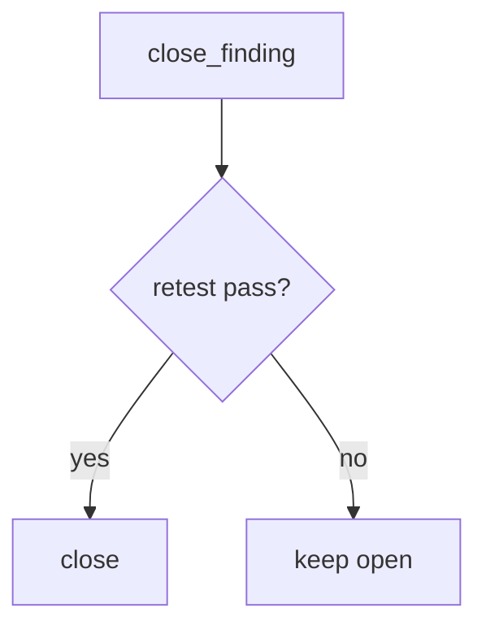

# 9.5-LO-04 — Require retest equals pass

**Kind:** design-exercise
**Loop step:** 4 Build
**Standards:** OWASP ASVS 5.0.0 (final) `v5.0.0-8.2.1`. NIST SSDF 1.1 (final) RV.2. `v5.0.0-8.3.2` is **Level 3, advanced**. WSTG 4.2 (final) as catalogue. WSTG 5.0 is **draft**.

## Structural means close looks at the retest field

`close_finding` must require `retest == "pass"`. Missing, `"fail"`, or `"scheduled"` is deny. That is the lab stand-in for “the same 9.3 isolation command passed.” Structural means that equality — not a PDF attachment, not Jira Done, not CVSS 9.8.

The smallest restore for SecureCollab’s AUTHZ-1 close loop is: `{retest: None}` → cannot close. Fail-safe: missing field is deny. Do not fail open because the report was filed. Do not accept a retest of `/health` as the isolation cell.

## Mental model: missing retest fails closed



The lab’s fixed tree requires `retest == "pass"`. Production still needs that pass to be the *same* forbidden outcome (bob must not read alice’s note) — a well-labeled `"pass"` on a different URL is a lying retest. Field grain remains 7.2. Level 3 grant-change cache (`v5.0.0-8.3.2`) still needs a retest of *the cache after role change*, not a different endpoint.

SSDF 1.1 RV.2 wants defects verified as fixed. This pytest is that sentence for close-without-retest.

## Why this restores the cell

| After the fix | Must be true |
|---|---|
| `{retest: None}` | close false |
| `{retest: "pass"}` | close true |

## What this is not

CVSS. KEV. Jira Done. A PDF. Gate 9. A retest of `/health`. WSTG membership. Exploratory leftovers as close.

## Mechanism limits

- A `"pass"` on the wrong URL still closes in this lab.
- Same-root-cause variants (7.2 fields) are not searched by `close_finding`.
- Level 3 grant-change cache (`v5.0.0-8.3.2`) is a different forbidden outcome.
- Exploratory testing leftovers remain 9.5 residuals, not this predicate.
- `"scheduled"` is deny here; production may track a calendar without closing.

## Practice

Name the residual (variants; wrong endpoint). Run:

```text
python3 -m pytest labs/9.5/9.5-lab/tests --impl fixed
```

Must pass. Run from the lab directory if collection at repo root is polluted.

## Transfer

Clinic: keep the finding open until the isolation pytest is green.

## Residual risk

Same-root-cause variants (7.2 fields); `v5.0.0-8.3.2` Level 3 caches; exploratory leftovers; business vs CVSS priority.

## Non-goals

Do not pentest a public host. Do not claim Gate 9 from a PDF. Do not present WSTG 5.0 as final.
