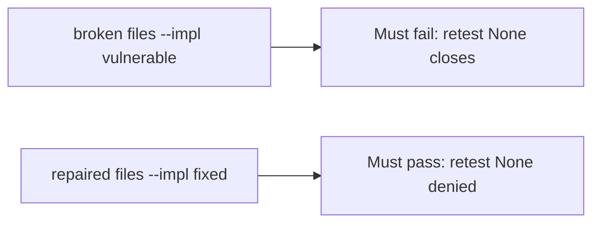

# A broken close gate must fail the check

**Kind:** verification-lab
**Loop step:** 5 Verify

## Check it

Attaching a PDF does not close the finding. Severity 9.8 is a priority number. `close_finding({"retest": None})` has to be false, and `{retest: "pass"}` may close. On the broken files a missing retest still closes. On the repaired files it does not. Do not pentest public hosts.

## Picture: a broken close gate must fail the check

A passing-test tally can still hide that `{retest: None}` still closes.



If both pass, you are not looking at missing retest.

## What the check has to show

| Mode | Must show for this topic |
|---|---|
| Normal | `retest pass` → may close (may pass on both) |
| Wrong input | `retest None` → cannot close; broken files must fail |
| Abuse | Missing, fail, or scheduled still deny (fail closed) |
| Not claimed | A live testing-guide list run; an assurance gate; a severity calculator; that pass hit the same URL |

The test `test_cannot_close_without_retest` is there so always-true `close_finding` still fails.

A close with `retest` set to `"pass"` may pass on both sides. You still have to deny a close that skipped retest. If the broken files do not fail `test_cannot_close_without_retest`, the lab is miswired — fix the wiring, not the assertion.

```text
python3 -m pytest labs/9.5/9.5-lab/tests --impl vulnerable
python3 -m pytest labs/9.5/9.5-lab/tests --impl fixed
```

A `Done` status in a ticket is not `close_finding({"retest": None})`. This practice never opens a live host.

## What the tests do not prove

- That the retest hit the same URL as the original isolation check
- Variant coverage (extra fields on the note)
- Whether a known-exploited listing applies
- Role-change cache after a grant change (extra, advanced work)
- This page does not close a finding check-in

## Practice

Do not treat a grep for `Done` in a ticket as the check. Call `close_finding({"retest": None})`.

## Use it somewhere new

Asserting "ticket status Done" is not this check. Do not run a live pentest.

## What this page is not doing

Do not treat a live host screenshot as proof. Do not log note bodies. Answer keys are not on this site. This page does not mark you as finished.
