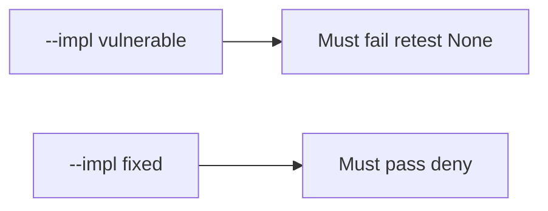

# 9.5-LO-05 — Evidence is close-without-retest denied, then a passing pair

**Kind:** verification-lab
**Loop step:** 5 Verify
**Standards:** OWASP ASVS 5.0.0 (final) `v5.0.0-8.2.1`.

## An invariant that cannot fail a test is still a slogan

“PDF delivered” is not evidence. The oracle is the local pair. Do not pentest public hosts.

## Mental model: vulnerable must fail: retest None

The failing observation on `--impl vulnerable` is **retest None**. A passing collection count is not this cell.



| Case | Must show |
|---|---|
| Negative / abuse | `retest None` → cannot close |
| Normal | `retest pass` → may close |
| Not claimed | live WSTG; Gate 9; CVSS calculator |

```
python3 -m pytest labs/9.5/9.5-lab/tests --impl vulnerable
python3 -m pytest labs/9.5/9.5-lab/tests --impl fixed
```

Honest `{retest: "pass"}` may pass on both.

## What the tests do not prove

- That the retest hit the same URL
- Variant coverage
- KEV applicability

## Practice

Execute both implementations. Map each test to an LO-02 cell.

## Transfer

Clinic: a test that only asserts “ticket status Done” is not this cell.
