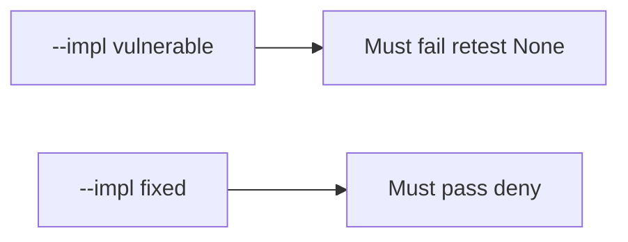

# 9.5-LO-05 — Evidence is close-without-retest denied, then a passing pair

**Kind:** verification-lab
**Loop step:** 5 Verify
**Standards:** OWASP ASVS 5.0.0 (final) `v5.0.0-8.2.1`. WSTG 4.2 (final). CVSS 4.0 as input, not the oracle.

## An invariant that cannot fail a test is still a slogan

“PDF delivered” is not evidence. “CVSS 9.8” is a priority input. The oracle is: `close_finding({"retest": None})` is false and `{retest: "pass"}` may close. The missing-retest observation must be **false** on `--impl vulnerable` (returns true) and **true** on `--impl fixed`. Do not pentest public hosts.

## Mental model: vulnerable must fail: retest None

The failing observation on `--impl vulnerable` is **retest None**. A passing collection count is not this cell.



| Mode | Must show for this module |
|---|---|
| Negative / abuse | `retest None` → cannot close; vulnerable must fail |
| Normal | `retest pass` → may close (may pass on both) |
| Not claimed | live WSTG; Gate 9; CVSS calculator; that pass hit the same URL |

Lab tests in `labs/9.5/9.5-lab/tests/test_property.py`. `test_cannot_close_without_retest` is a **forbidden-outcome** test: always-true `close_finding` is not allowed to count as a passing control.

```text
python3 -m pytest labs/9.5/9.5-lab/tests --impl vulnerable
python3 -m pytest labs/9.5/9.5-lab/tests --impl fixed
```

Honest `{retest: "pass"}` may pass on both implementations. That does not excuse the missing-retest deny test. If vulnerable does not fail `test_cannot_close_without_retest`, the lab is miswired—fix the wiring, not the assertion.

## What the tests do not prove

- That the retest hit the same URL as the original isolation cell
- Variant coverage (7.2 fields)
- KEV applicability
- Level 3 grant-change cache (`v5.0.0-8.3.2`)
- Gate 9 complete

Record those as residuals or later modules, not as silent passes.

## Practice

Execute both implementations this session from the lab directory if needed. Write the fail/pass pair next to the matrix row. Reject a “test” that only greps `Done` in Jira without calling `close_finding({"retest": None})`.

## Transfer

Clinic: a test that only asserts “ticket status Done” is not this cell. A live pentest is out of scope.

## Non-goals

Do not add a live-host trophy. Do not log note bodies. Keys stay out of this file. Gate 9 stays not-attempted.
