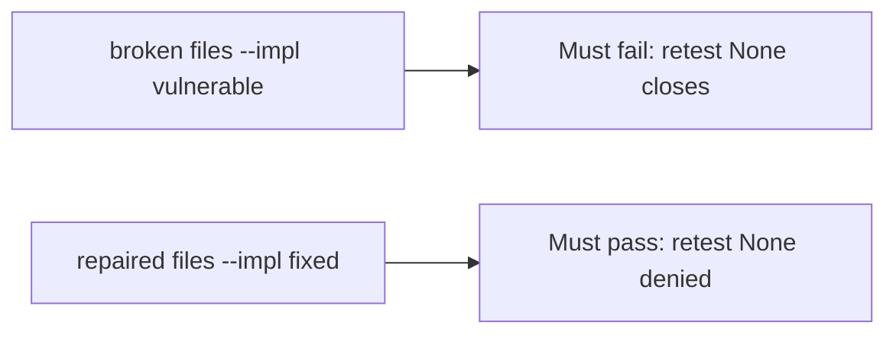

# A broken close gate must fail the check

**Kind:** verification-lab
**Loop step:** 5 Verify

## Check it

"PDF delivered" is not evidence. "The severity is 9.8" is a priority input. The check is: `close_finding({"retest": None})` is false and `{retest: "pass"}` may close. That missing-retest observation must be **false** on the broken files and **true** on the repaired files. Do not pentest public hosts.

## Picture: a broken close gate must fail the check

A check that only counts passing tests can still look green while `{retest: None}` still closes.



If both pass, the test is not looking at missing retest.

## What the check has to show

| Mode | Must show for this topic |
|---|---|
| Normal | `retest pass` → may close (may pass on both) |
| Wrong input | `retest None` → cannot close; broken files must fail |
| Abuse | Missing, fail, or scheduled still deny (fail closed) |
| Not claimed | A live testing-guide list run; an assurance gate; a severity calculator; that pass hit the same URL |

The test `test_cannot_close_without_retest` is there so always-true `close_finding` cannot sneak through.

Honest `{retest: "pass"}` may pass on both implementations. That does not excuse the missing-retest deny test. If the broken files do not fail `test_cannot_close_without_retest`, the lab is miswired — fix the wiring, not the assertion.

```text
python3 -m pytest labs/9.5/9.5-lab/tests --impl vulnerable
python3 -m pytest labs/9.5/9.5-lab/tests --impl fixed
```

A test that only greps `Done` in a ticket tracker without calling `close_finding({"retest": None})` is not this topic's evidence. This practice never opens a live host.

## What the tests do not prove

- That the retest hit the same URL as the original isolation check
- Variant coverage (extra fields on the note)
- Whether a known-exploited listing applies
- Role-change cache after a grant change (extra, advanced work)
- An assurance gate complete

## Practice

```text
python3 -m pytest labs/9.5/9.5-lab/tests --impl vulnerable
python3 -m pytest labs/9.5/9.5-lab/tests --impl fixed
```

Reject a "test" that only greps `Done` in a ticket without calling `close_finding({"retest": None})`.

## Use it somewhere new

A clinic example: a test that only asserts "ticket status Done" is not this topic. A live pentest is out of scope.

## What this page is not doing

Do not treat a live host screenshot as proof. Do not log note bodies. Answer keys are not on this site. This page does not mark you as finished.
