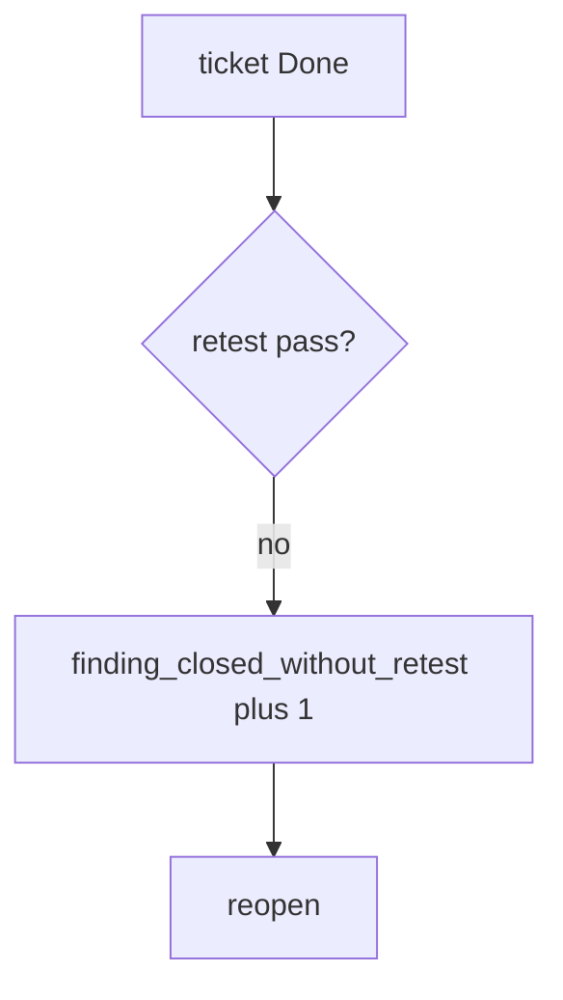

# 9.5-LO-06 — Detect finding_closed_without_retest without logging bodies

**Kind:** operations-exercise
**Loop step:** 6 Operate
**Standards:** NIST CSF 2.0 (final) DE/RS/RC as outcome labels; NIST SSDF 1.1 (final) RV.2. ASVS 5.0.0 (final) `v5.0.0-8.2.1`.

## Prevention is not absolute

A closer can still mark Done after `close_finding` was “fixed once.” Pair detect and recover. Do not log note bodies from the original finding (3.1). Do not attach patient JSON to the ticket. Do not paste a live-target URL into Slack.

## Mental model: close without retest is a signal



| Outcome | This module |
|---|---|
| Detect | `finding_closed_without_retest` |
| Signal | finding id, cell id; never bodies |
| Recover | Reopen; run the same 9.3 isolation pytest |
| Residual | Variants; CVSS vs business priority; Level 3 caches |

CSF 2.0 Detect / Respond / Recover name outcomes. They do not prove RV.2. A ticketing-product name is not the property. Re-run `test_cannot_close_without_retest` after any close-workflow change; a green “PDF attached” tile is not that pytest. Field-level variants (7.2) and grant-change cache (`v5.0.0-8.3.2`, Level 3) are other forbidden outcomes of the same family — inventory them before claiming Recover.

## Framework defaults versus the operate guarantee

A Jira dashboard will show Done counts and stay silent when CI’s `close_finding` is always true. Detection must observe **retest None is deny**, not ticket volume. If the alert includes a note body or a patient row, you have opened a 3.1 cell.

## Practice

Write one log line you would accept. Tie it to `labs/9.5/9.5-lab`.

```text
log_denied reason=finding_closed_without_retest finding=F-authz-1
```

Reject any line that includes a note body, a live-target URL, or “Gate 9 complete.”

## Transfer

Clinic: reopen the PDF-shelf ticket; do not attach patient rows. Do not pentest a live EHR.

## Usability

A reopen notice must say *why* the finding stayed open (missing retest), not only “assert False” (WCAG 2.2 Success Criterion 4.1.3 for human-read CI).

Cause vs impact stays split here too: the **cause** is close looking at intent (PDF, Jira Done) instead of `retest == "pass"`; the **impact** is an isolation hole that looks remediated; **prevention** is the retest equality; **detection** is `finding_closed_without_retest`; **recovery** is reopen and re-run the same 9.3 isolation pytest. Mechanism limit: this alert does not prove the `"pass"` hit the same URL, and it does not search 7.2 field variants or Level 3 grant-change caches (`v5.0.0-8.3.2`).

## Non-goals

A ticketing-product name is not the property. Gate 9 stays not-attempted. KEV is not a scan license.
