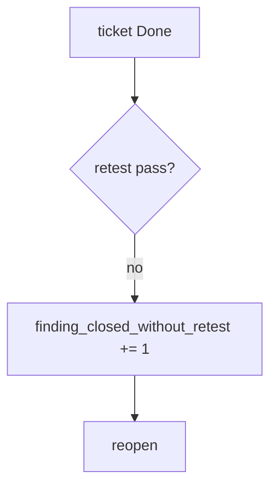

# 9.5-LO-06 — Detect finding_closed_without_retest without logging bodies

**Kind:** operations-exercise
**Loop step:** 6 Operate
**Standards:** NIST CSF 2.0 (final) DE/RS/RC as outcome labels; NIST SSDF 1.1 RV.2.

## Prevention is not absolute

A closer can still mark Done. Pair detect and recover. Do not log note bodies from the original finding (3.1).

## Mental model: close without retest is a signal



| Outcome | This module |
|---|---|
| Detect | `finding_closed_without_retest` |
| Signal | finding id, cell id; never bodies |
| Recover | Reopen; run the same pytest |
| Residual | Variants; CVSS vs business priority |

## Practice

Write one log line you would accept. Tie it to `labs/9.5/9.5-lab`.

```
log_denied reason=finding_closed_without_retest finding=F-authz-1
```

Reject any line that includes a note body, a live-target URL, or “Gate 9 complete.”

## Transfer

Clinic: reopen the PDF-shelf ticket; do not attach patient rows.

## Non-goals

A ticketing-product name is not the property. Gate 9 stays not-attempted.
