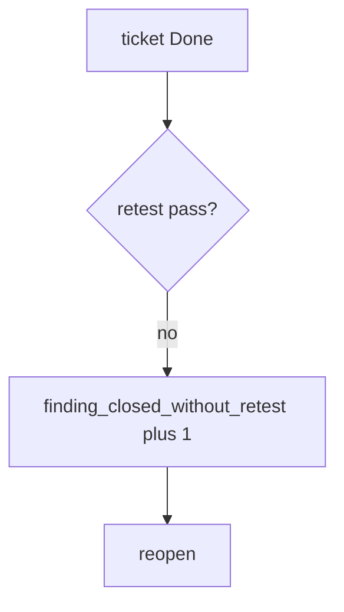

# Notice a close without a retest, without logging notes

**Kind:** operations-exercise
**Loop step:** 6 Operate

## Fixing it once is not enough

A closer can still mark Done without replaying the same isolation check. Skip original finding bodies and patient JSON in the ticket. Do not paste a live-target URL into chat.

## Picture: close without retest is a signal

If a finding is closed without a retest, page the finding id — not the finding text. Then reopen and re-run the same isolation check.



Moving a ticket to Done does not replay the finding.

Close without a pass on the same URL still has to fail `test_cannot_close_without_retest`. Attaching a PDF does not prove the finding was retested. Extra fields on the note and a role-change cache can reopen the same hole; do not close the ticket until those paths are named.

## Signals that do not become a second leak

| Outcome | This topic |
|---|---|
| Notice | `finding_closed_without_retest` |
| What the line holds | Finding id, rule id; **never** bodies |
| Respond | Stop the closer that ignored retest; do not paste note text into chat |
| Recover | Reopen; run the same isolation check |
| Leftover | Variants; severity vs business priority; role-change caches |

A ticket dashboard will show Done counts and stay silent when CI's `close_finding` is always true. Detection must observe **retest None is deny**, not ticket volume. If the alert includes a note body or a patient row, you have opened a leftover-body leak.

```text
log_denied reason=finding_closed_without_retest finding=F-authz-1
```

Not: a note body, a live-target URL, or "assurance gate complete."

Putting the matching note in the alert puts the finding in the pager too.

## What the framework does vs what you still have to check

A `"pass"` on the wrong URL, extra-field variants, and role-change caches still close the ticket while the hole is open.

The **cause** is close looking at intent (PDF, ticket Done) instead of `retest == "pass"`; the **cost** is an isolation hole that looks fixed; **how you stop it** is the retest equality; **how you notice** is `finding_closed_without_retest`; **how you recover** is reopen and re-run the same isolation check. What the tool cannot do: this alert does not prove the `"pass"` hit the same URL, and it does not search extra fields or role-change caches.

## Can people still use it

A reopen notice must say *why* the finding stayed open (missing retest), not only "assert False." Do not encode that reason as color only.

## Practice

```text
log_denied reason=finding_closed_without_retest finding=F-authz-1
```

Reject any line that includes a note body, a live-target URL, or "assurance gate complete."

## Use it somewhere new

Reopen the PDF-shelf ticket; do not attach patient rows. Do not pentest a live clinic system.

## What this page is not doing

This page does not mark you as finished. A known-exploited listing is not permission to scan. Answer keys are not on this site.
