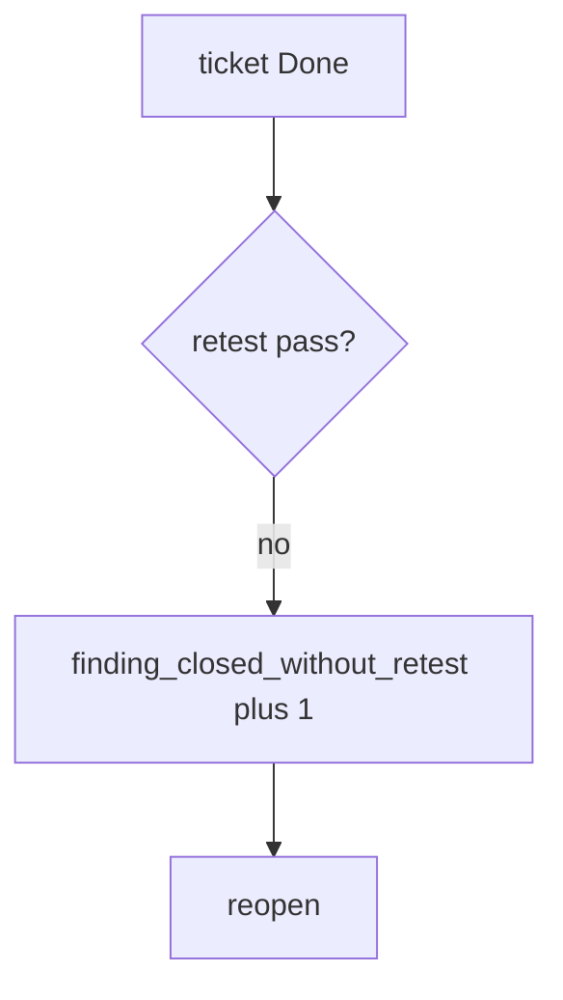

# finding_closed_without_retest without logging bodies

**Kind:** operations-exercise
**Loop step:** 6 Operate

## Stopping it is not enough

A closer can still mark Done after `close_finding` was "fixed once." Pair notice and recover. Do not log note bodies from the original finding. Do not attach patient JSON to the ticket. Do not paste a live-target URL into chat.

## Picture: close without retest is a signal

A close that skipped retest is a notice-and-recover problem, not a licence to quote the note in the paging channel. Notice names the finding. Recover reopens and re-runs the same isolation pytest. Neither reprints the body.



Industry lists name detect, respond, recover. They do not pick a ticket product. They do not prove this finding was retested. Someone still has to own the leftover.

Re-run `test_cannot_close_without_retest` after any close-workflow change. A green "PDF attached" tile is not that pytest. Extra fields on the note and a role-change cache are other bad results in the same family — inventory them before you claim recover.

## Signals that do not become a second leak

| Outcome | This topic |
|---|---|
| Notice | `finding_closed_without_retest` |
| What the line holds | Finding id, rule id; **never** bodies |
| Respond | Stop the closer that ignored retest; do not paste note text into chat |
| Recover | Reopen; run the same isolation pytest |
| Leftover | Variants; severity vs business priority; role-change caches |

A ticket dashboard will show Done counts and stay silent when CI's `close_finding` is always true. Detection must observe **retest None is deny**, not ticket volume. If the alert includes a note body or a patient row, you have opened a leftover-body leak.

A log line a reviewer can accept looks like:

```text
log_denied reason=finding_closed_without_retest finding=F-authz-1
```

Not: a note body, a live-target URL, or "assurance gate complete."

If your alert includes the matching note, you have copied the leak into the paging channel.

## What the framework does vs what you still have to check

The same wrong-URL `"pass"`, extra-field variants, and role-change caches that bypass this practice will also bypass a "scan our ticket dashboard" detector. Name those places before you claim recover. A ticket-product name is not the rule.

Cause vs cost stays split here too: the **cause** is close looking at intent (PDF, ticket Done) instead of `retest == "pass"`; the **cost** is an isolation hole that looks fixed; **how you stop it** is the retest equality; **how you notice** is `finding_closed_without_retest`; **how you recover** is reopen and re-run the same isolation pytest. What the tool cannot do: this alert does not prove the `"pass"` hit the same URL, and it does not search extra fields or role-change caches.

## Can people still use it

A reopen notice must say *why* the finding stayed open (missing retest), not only "assert False." Do not encode that reason as color only.

## Practice

Write one log line you would accept in review. Tie it to `labs/9.5/9.5-lab`.

```text
log_denied reason=finding_closed_without_retest finding=F-authz-1
```

Reject any line that includes a note body, a live-target URL, or "assurance gate complete."

## Use it somewhere new

Clinic: reopen the PDF-shelf ticket; do not attach patient rows. Do not pentest a live clinic system.

## What this page is not doing

A ticket-product name is not the rule. Do not claim you finished an assurance gate. A known-exploited listing is not a scan licence. Answer keys stay out of lessons.
