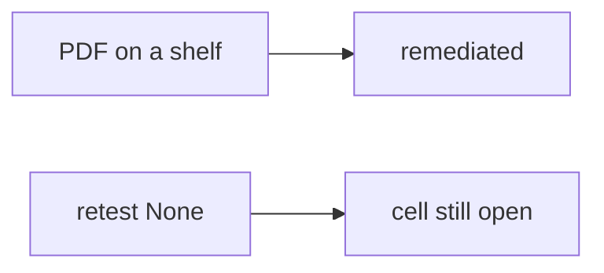

# 9.5-LO-07 — Transfer: clinic pentest PDF shelf

**Kind:** transfer-challenge
**Loop step:** 7 Transfer
**Standards:** OWASP WSTG 4.2 (final). CVSS 4.0 as input. CISA KEV as context. Local scope only.

## Change the workplace; keep PDF from meaning closed

Do not answer with a Top 10 / CWE / scanner as the definition of security.

**Prompt:** Clinic pentest PDF shelf. Also name KEV vs internal-only.

**Product sketch:** EHR-lite “the assessor delivered a 40-page PDF with CVSS 9.8 so we closed isolation,” plus “KEV says we must scan the hospital portal.”

Rewrite the SecureCollab sentence. Include:

1. attacker capabilities (paper-compliance closer — not a live hospital);
2. trust assumptions (same-cell retest is TCB; PDF/CVSS/KEV are not);
3. forbidden outcome (`close_finding({retest: None})` true, not “HIPAA”);
4. a test idea on a **local** fixture only (no live pentest);
5. residual (variants, `v5.0.0-8.3.2` Level 3, business vs CVSS priority);
6. WCAG if engineers read the report (structure, not color-only severity).

## Mental model: shelf vs pytest

## What graders reject

| Reject | Why |
|---|---|
| “CVSS 9.8 so we closed” | Input, not retest |
| Live clinic / public KEV scan | Lab policy |
| “WSTG 5.0 final” | 5.0 is in development |

## Practice

One page. No keys. `labs/9.5/9.5-lab` is the only running system you may break.
