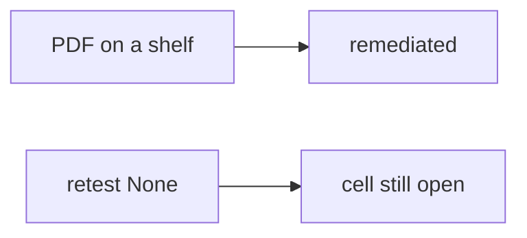

# 9.5-LO-07 — Transfer: clinic pentest PDF shelf

**Kind:** transfer-challenge
**Loop step:** 7 Transfer
**Standards:** OWASP WSTG 4.2 (final). CVSS 4.0 as input. CISA KEV as context. ASVS `v5.0.0-8.2.1`. WSTG 5.0 remains **draft**. Local scope only.

## Change the workplace; keep PDF from meaning closed

Do not answer with a Top 10 / CWE / scanner as the definition of security. The SecureCollab sentence was: `close_finding({"retest": None})` must be false. Rewrite it for a clinic without changing the fork.

**Prompt:** Clinic pentest PDF shelf. Also name KEV vs internal-only.

**Product sketch:** EHR-lite “the assessor delivered a 40-page PDF with CVSS 9.8 so we closed isolation,” plus “KEV says we must scan the hospital portal.”

Rewrite the SecureCollab sentence. Include:

1. attacker capabilities (paper-compliance closer — not a live clinic);
2. trust assumptions (same-cell retest is TCB; PDF/CVSS/KEV are not);
3. forbidden outcome (`close_finding({retest: None})` true, not “HIPAA”);
4. a test idea on a **local** fixture only (no live pentest);
5. residual (variants, `v5.0.0-8.3.2` Level 3, business vs CVSS priority);
6. WCAG if engineers read the report (structure, not color-only severity).

## Mental model: shelf vs pytest

If the PDF is filed while `close_finding` is always true, the cell is gone. Jira Done, CVSS 9.8, and a KEV listing do not set `retest` to `"pass"`. Field grain (7.2) and grant-change cache (`v5.0.0-8.3.2`) are the same close-loop family — name them, do not pentest a live EHR here. WSTG 5.0 is in development; 4.2 is the final pin. KEV is whether exploitation is *observed in the wild* for an internal-only bug, not a license to scan a public clinic.

The clinic rewrite still has to keep the SecureCollab fork: missing retest denied, passing retest may close. Uploading the PDF without a retest field leaves `close_finding({retest: None})` true. The local pytest analogue is `test_cannot_close_without_retest` — on a fixture, not a live host.

## What graders reject

| Reject | Why |
|---|---|
| “CVSS 9.8 so we closed” | Input, not retest |
| Live clinic / public KEV scan | Lab policy |
| “WSTG 5.0” as final | 5.0 is in development; 4.2 is the final pin |
| Jira Done as this cell | Workflow, not the predicate |
| PDF attachment as `retest` | Report is not the same-cell pytest |

## Practice

One page. No keys. `labs/9.5/9.5-lab` is the only running system you may break. Do not pentest a public host.

## Non-goals

Live-target pentest. Real PHI in findings. Claiming Gate 9 from this page.
