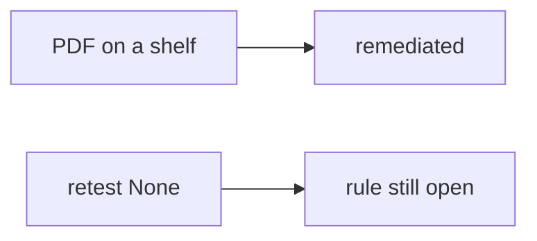

# Same idea on a clinic pentest PDF shelf

**Kind:** transfer-challenge
**Loop step:** 7 Transfer

## Use it somewhere new

You get a **clinic pentest PDF on a shelf**.

`close_finding({"retest": None})` must be false. For a clinic, missing retest denied, passing retest may close. A PDF on a shelf is still a report, not a retest.

An EHR-lite "the assessor delivered a 40-page PDF with severity 9.8 so we closed isolation," plus "the known-exploited list says we must scan the hospital portal."

## Picture: same close loop, clinical object

Here, closing a clinic ticket is still this topic’s close-without-retest rule. Name the rule, the retest, and what still changes after close. Filing the PDF and marking the ticket Done does not set `retest` to `"pass"`.

| Notes app | Clinic sketch |
|---|---|
| Bob must not read alice's note | A clinic staffer must not read another patient's chart |
| The isolation check must pass before close | Same isolation check on **local** practice files |
| `close_finding({"retest": None})` | Same call — missing retest still denied |
| Paper-compliance closer | Same closer — **not** a live clinic |
| PDF / severity / known-exploited list | Same inputs — not the close decision |

If the PDF is filed while `close_finding` is always true, the rule is gone. A ticket marked Done, a 9.8 severity, and a known-exploited listing do not set `retest` to `"pass"`. Extra fields and a role-change cache are the same close-loop family — name them, do not pentest a live clinic system here. A testing-guide draft is in development; the current final pin is the published testing guide. A known-exploited list is whether exploitation is *observed in the wild* for an internal-only bug, not permission to scan a public clinic.

A missing retest still has to be denied. A passing retest may still close. Uploading the PDF without a retest field leaves `close_finding({retest: None})` true. The local check is `test_cannot_close_without_retest` — on a practice, not a live host.

## Write this for a clinic pentest PDF on a shelf

1. who might try (paper-compliance closer — not a live clinic);
2. what you trust (same-rule retest is the promise; PDF, severity score, and a known-exploited list are not);
3. what must not happen (`close_finding({retest: None})` true);
4. a check on **local** practice files only (no live pentest);
5. leftover (variants, role-change cache, business vs severity priority);
6. whether engineers read the report (structure, not color-only severity).

Use fake labels. Do not use real patient names.

Also name known-exploited list vs internal-only.

## What is not good enough

| Reject | Why |
|---|---|
| "Severity 9.8 so we closed" | Input, not retest |
| Live clinic / public known-exploited scan | Course rules |
| A testing-guide draft as the current final pin | Draft, not this pin |
| Ticket Done as this topic | Workflow, not the check |
| PDF attachment as `retest` | Report is not the same-rule check |

## Practice

Write one page. Leave the answer keys closed. `labs/9.5/9.5-lab` is the only running system you may break. Do not pentest a public host.

## What this page is not doing

Do not try live-target pentest. Do not use real patient charts in findings. This page does not finish an assurance gate.
