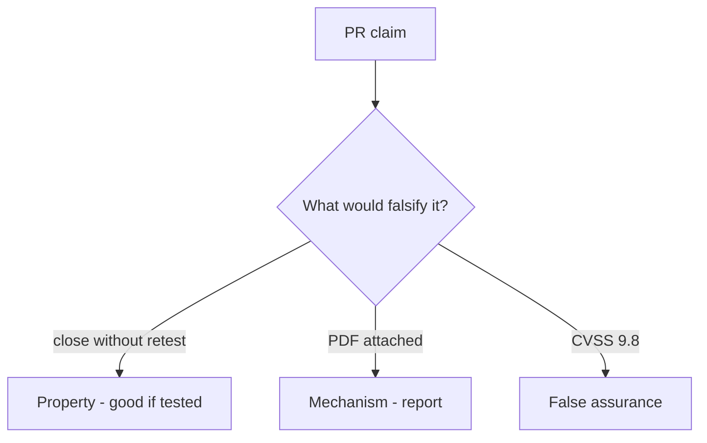

# 9.5-LO-08 — Review always-true close_finding as a PR

**Kind:** code-review
**Loop step:** Review
**Standards:** OWASP WSTG 4.2 (final). ASVS `v5.0.0-8.2.1`. CVSS 4.0 as input.

## Review the fixture as if it were SecureCollab’s close gate

Review `labs/9.5/9.5-lab/vulnerable/` as a SecureCollab PR. Intended findings live only in `content/assessment/keys/9.5.md` — not here.

## Mental model: property, mechanism, or false assurance

Seeded smells (label them yourself; do not open the keys file):

- close without retest
- CVSS as the only priority
- Live-target language
- No variant search

Also reject: public pentest steps, keys in lessons, claiming Gate 9.

## Misconceptions

- A PDF report is remediation
- CVSS 9.8 is the close decision
- KEV listing authorizes scanning public systems

## Practice

Write three review notes. Tie at least one to `test_cannot_close_without_retest`.

## Transfer

Clinic PR that “uploaded the pentest PDF” without a retest field is incomplete.
