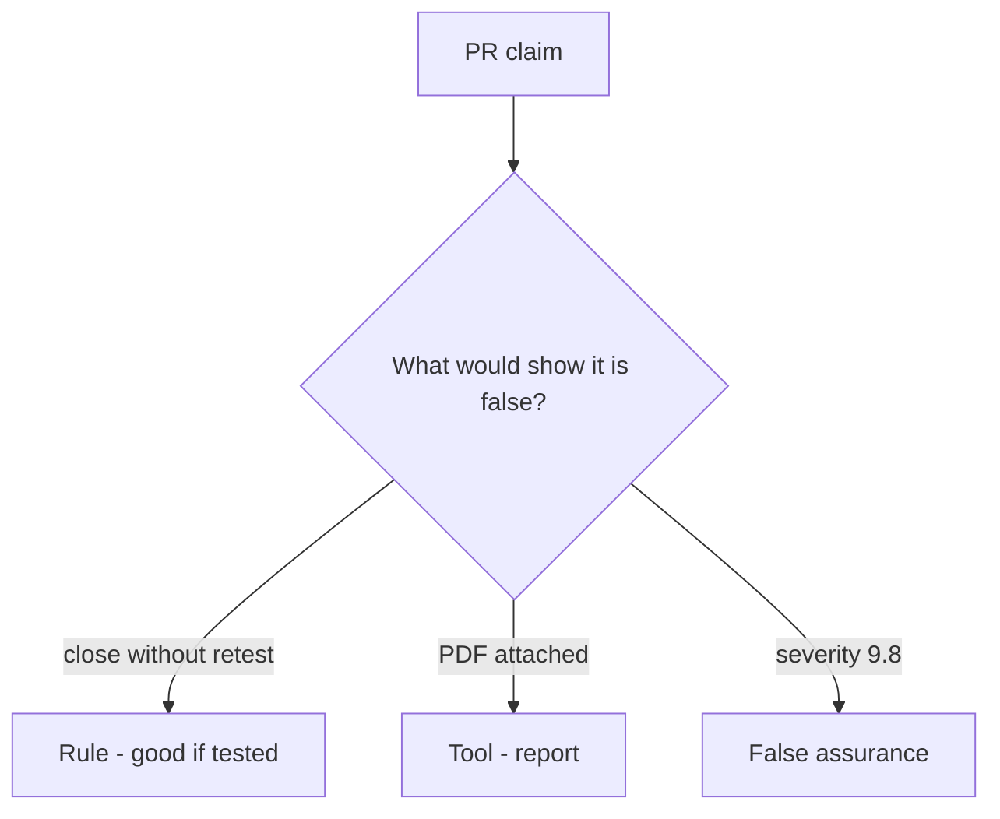

# Would you merge this always-true close_finding?

**Kind:** code-review
**Loop step:** Review

## What you are reviewing

The files in `labs/9.5/9.5-lab/vulnerable/` are the close-gate change. Does `close_finding({"retest": None})` still return true?

Open `close_finding` and the missing-retest row, not a PDF on a shelf. A sticky note "will retest later" is not `test_cannot_close_without_retest` going green.

## Picture: close without retest

**close without retest**.

A missing retest still has to be denied. If the change never checks `retest == "pass"`, that always-close leftover is still open. A PDF screenshot does not replace that check.

Variants (extra fields) and a role-change cache are other leftover. Name them, do not skip `test_cannot_close_without_retest`. This page does not mark you as finished. Do not pentest a live tenant to prove the finding.

## Problems to find (name them yourself)

- close without retest
- severity as the only priority
- live-target language
- no variant search

Also reject: public pentest steps; closing findings without re-running `test_cannot_close_without_retest`; keys in learner notes; treating this retest lesson as a check-in; treating a known-exploited list as permission to scan.

## Common mix-ups

- A PDF report is the fix
- Severity 9.8 is the close decision
- A known-exploited listing authorizes scanning public systems
- A testing-guide draft is the current final pin
- A filed report does not finish a check-in

## Use it somewhere new

Uploading the pentest PDF without a retest field does not close the finding. A pentest PDF is not a retest field — write the close block.

## Can people still use it

A reopen notice must say why the finding stayed open (missing retest), not only "will retest later."

## What this page is not doing

A close without retest, plus "will retest later," is still unfinished work. Do not pentest a public host to prove the finding.
