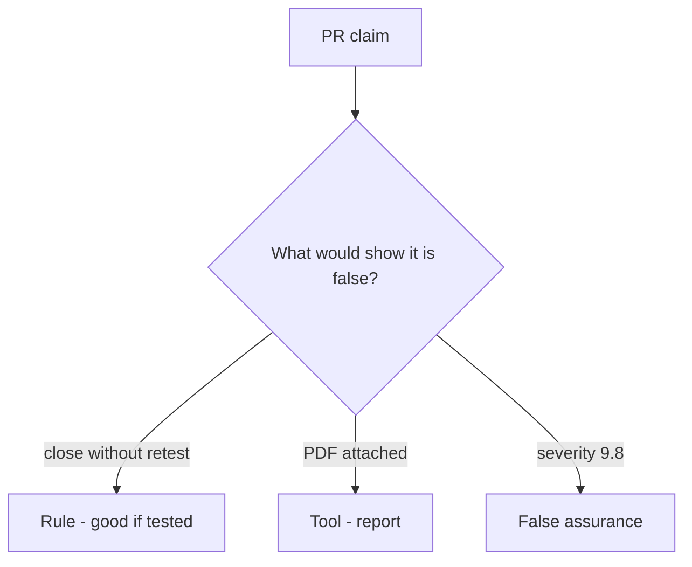

# Would you merge this always-true close_finding?

**Kind:** code-review
**Loop step:** Review

The answers are not on this page. Do not open the keys file until someone has looked at your review.

## What you are reviewing

A colleague ships the notes app's close gate. Review `labs/9.5/9.5-lab/vulnerable/` as that change. Check whether `close_finding({"retest": None})` still returns true, compare that with the rule, and write changes a developer can verify.

Start at `close_finding` and the missing-retest row, not at a scanner color or a PDF screenshot. The check you already ran (`test_cannot_close_without_retest`) is the rule test. A comment "will retest later" is not.

## Picture: close without retest

**close without retest**. Label it rule, tool, or false assurance before you accept the change.

What has to stay true: missing retest denied. If that call never includes `retest == "pass"`, that always-close leftover is still open. A PDF screenshot does not replace that check.

Variants (extra fields) and a role-change cache are other leftover. Name them, do not skip `test_cannot_close_without_retest`. This page does not mark you as finished. Do not pentest a live tenant to prove the finding.

## Problems to find (name them yourself)

- close without retest
- severity as the only priority
- live-target language
- no variant search

Also reject: public pentest steps; closing findings without re-running `test_cannot_close_without_retest`; keys in learner notes; claiming an assurance gate; treating a known-exploited list as a scan licence.

## Common mix-ups

- A PDF report is the fix
- Severity 9.8 is the close decision
- A known-exploited listing authorizes scanning public systems
- A testing-catalogue draft is the current final pin
- An assurance gate follows from a filed report

## Practice

Write three review notes a maintainer could act on. Each note: what you saw, rule or false assurance, suggested structural change, leftover you will **not** delete. Tie at least one note to `test_cannot_close_without_retest`. Do not open the keys file.

## Use it somewhere new

Clinic change that "uploaded the pentest PDF" without a retest field is an incomplete close-gate review. Name the independent falsehood that would still keep missing retest from closing.

## Can people still use it

A reopen notice must say why the finding stayed open (missing retest), not only "will retest later."

## What this page is not doing

Do not merge by adding a comment "will retest later." That comment is leftover without an owner. Do not pentest a public host to prove the finding.
