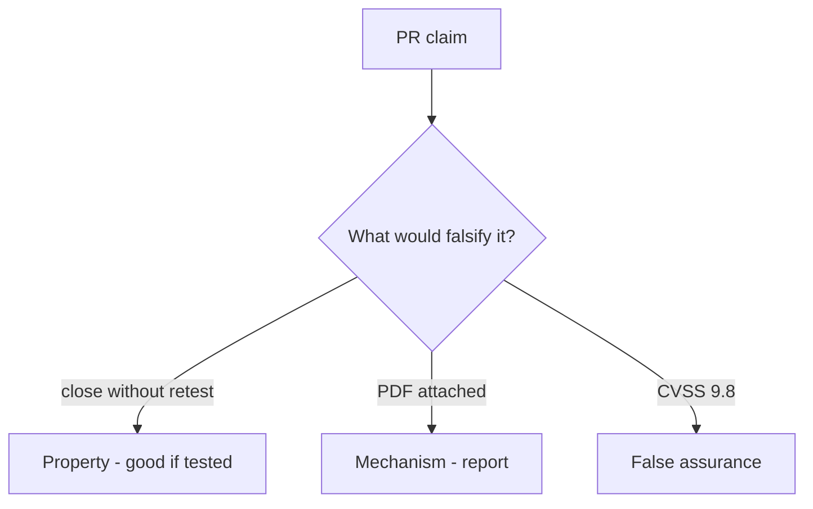

# 9.5-LO-08 — Review always-true close_finding as a PR

**Kind:** code-review
**Loop step:** Review
**Standards:** OWASP WSTG 4.2 (final). ASVS `v5.0.0-8.2.1`. CVSS 4.0 as input. CISA KEV as awareness.

## Review the fixture as if it were SecureCollab’s close gate

Review `labs/9.5/9.5-lab/vulnerable/` as a SecureCollab PR. Your job is not to count suspicious lines. Reconstruct whether `close_finding({"retest": None})` still returns true, compare that with the module invariant, and write changes a developer can verify.

Intended findings live only in `content/assessment/keys/9.5.md` — not here. Do not open the keys file until your review has been evaluated.

## Mental model: close without retest

Start with this seeded smell: **close without retest**. Label it property, mechanism, or false assurance before you accept the PR.

Classification starts at the protected effect (missing retest denied). Everything that is not `retest == "pass"` at that call is a candidate always-close path. A PDF screenshot without that pytest is the same smell, not a different finding class.

Variants are 7.2. Grant-change cache is `v5.0.0-8.3.2` Level 3. Do not skip `test_cannot_close_without_retest`. Do not claim Gate 9. Do not pentest a live tenant to prove the finding.

## Seeded smells (label them yourself)

- close without retest
- CVSS as the only priority
- Live-target language
- No variant search

Also reject: public pentest steps; closing findings without re-running `test_cannot_close_without_retest`; keys in lessons; claiming Gate 9; treating KEV as a scan license.

## Misconceptions this module refuses

- A PDF report is remediation
- CVSS 9.8 is the close decision
- KEV listing authorizes scanning public systems
- WSTG 5.0 is the current final pin
- Gate 9 follows from a filed report

## Practice

Write three review notes a maintainer could act on. Each note: observation, property or false assurance, suggested structural change, residual you will **not** delete. Tie at least one to `test_cannot_close_without_retest`.

## Transfer

Clinic PR that “uploaded the pentest PDF” without a retest field is an incomplete close-gate review. Name the independent falsehood that would still keep missing retest from closing.

## Non-goals

Do not merge by adding a comment “will retest later.” That comment is a residual without an owner. Do not pentest a public host to prove the finding.
