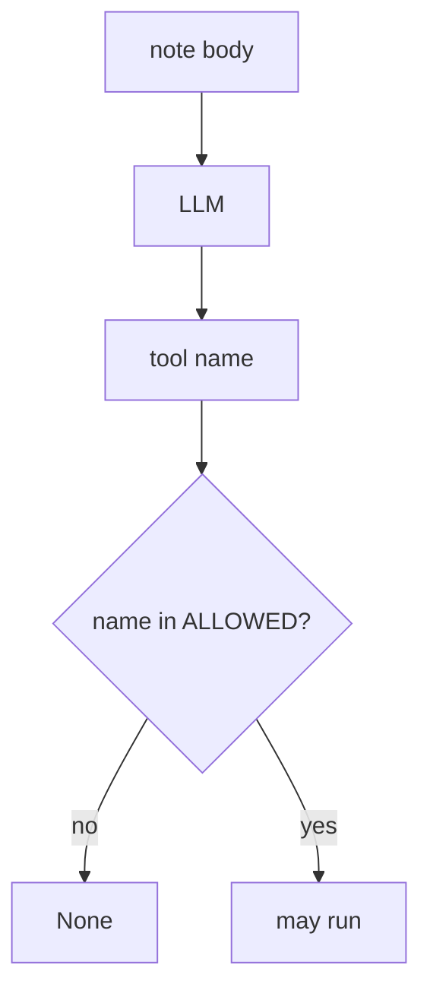
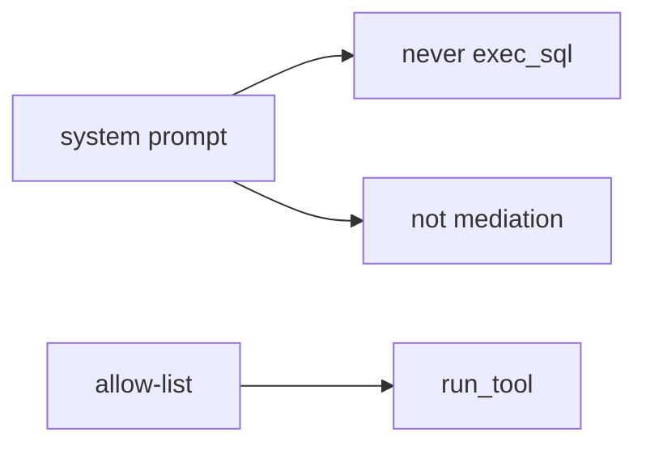

# A model proposal is not permission

**Kind:** concept-model
**Loop step:** 1 Property

## The rule

The notes app may add an optional note summarizer that can call tools. **Authorization of tools** is whether the *runtime* allow-lists the name. A model-proposed `exec_sql` is English from an untrusted client. It is not a grant.

> `run_tool("exec_sql", {})` must be `None`. `run_tool("search_notes", {})` may run.

So what must not happen: **the agent runs `exec_sql` because the model asked**. That is the interpreter lesson plus the mediation lesson, with the model as the confused deputy.

Industry checklists want access-control decisions in application logic or a policy engine, **never by the model**. They want an allow-list before a tool runs. Cryptographically bound human approvals are extra, advanced work, not this week's check. A famous-bugs list for language models names "too much agency" as a regression label after the cause, not the syllabus. Guidance documents on AI risk are not the lab oracle.

This week's practice is this course's local files. Do not tell anyone to try attacks on a public or live model.

## Picture: model vs runtime



## Picture: a prompt is not policy



**A tool, not the rule:** library defaults, "we have retrieval," a famous-bugs dashboard.

## Why it happens, what it costs, how you stop it, how you notice, how you recover

Someone treated model output as policy. That is the cause. An interpreter reached through English is a **result**, not the cause.

| Slice | For this rule |
|---|---|
| Why it happens | Model output treated as policy |
| What has to be true first | `run_tool("exec_sql")` executes |
| Trigger | Prompt injection in a note; poisoned retrieval |
| What it costs | Authorization of tools — interpreter via English |
| How you stop it | Allow-list; no `exec_sql`; human approval for high impact |
| How you notice | `tool_denied` |
| How you recover | Revoke leftover agent credentials |

## What the framework does vs what you still have to check

A tool library will expose whatever tools you pass. A system prompt is another string the model may ignore.

The app's promise is: **this** `run_tool("exec_sql", {})` is `None`. The local check is `labs/E1/e1-lab`. Fake tool names only. No live models.

## What the tool cannot do

- A prompt that says "never call `exec_sql`" is not mediation.
- Indirect injection through retrieved copy still reaches the model.
- Allow-listed `search_notes` can still return HTML.
- Hallucinated package names in a coding assistant stay a later leftover.

## Can people still use it

A human-approval screen for tools must be usable. If it is not, operators auto-approve.

## Practice

List tools and who may call them. Then run:

```text
python3 -m pytest labs/E1/e1-lab/tests --impl vulnerable
python3 -m pytest labs/E1/e1-lab/tests --impl fixed
```

The first command must fail. The second must pass.

## Use it somewhere new

A coding assistant in CI. Clinic summarizer over charts.

## What this page is not doing

Live model APIs, claiming you finished an assurance gate from this page. Answer keys are not on this site.
