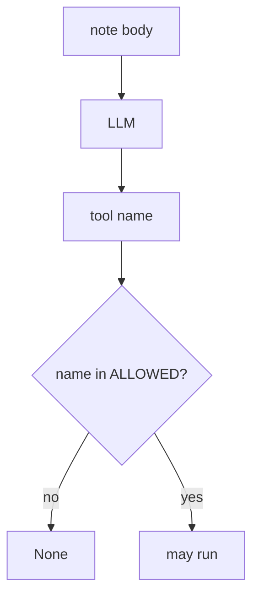
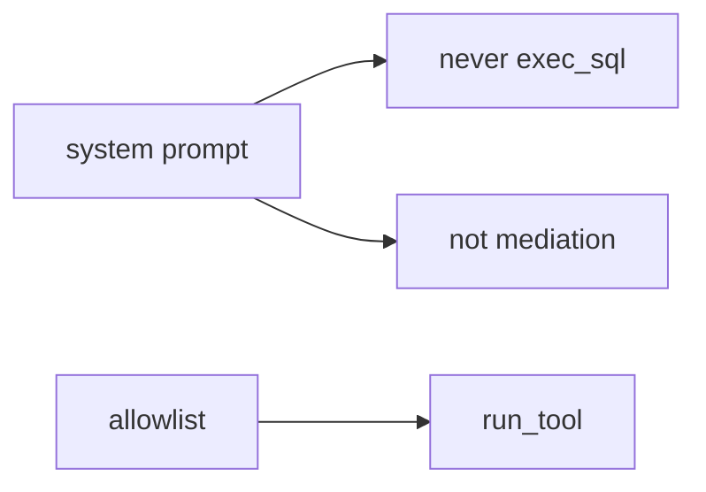

# E1-LO-01 — A model proposal is not authorization

**Kind:** concept-model
**Loop step:** 1 Property
**Standards:** OWASP AISVS 1.0 (final) `v1.0-C9.5.3`, `v1.0-C9.3.7`; `v1.0-C9.2.8` is **Level 3, advanced**. ASVS `v5.0.0-8.2.1`, `v5.0.0-13.2.1`. LLM Top 10 2026 LLM03 is **awareness after** the cause. NIST AI 600-1 and SP 800-218A are guidance.

## The claim this module owns

SecureCollab may add an optional note summarizer that can call tools. **Authorization of tools** is whether the *runtime* allowlists the name. A model-proposed `exec_sql` is English from an untrusted client (8.1), not a grant.

> `run_tool("exec_sql", {})` must be `None`. `run_tool("search_notes", {})` may run.

The forbidden outcome is **agent executes exec_sql because the model asked**. That is 6.1 (interpreter) plus 1.2 (mediation) with the model as the confused deputy.

AISVS `v1.0-C9.5.3` wants access-control decisions enforced by application logic or a policy engine, **never by the AI model**. `v1.0-C9.3.7` wants an allow-list before invoke. `v1.0-C9.2.8` (cryptographically bound approvals) is **Level 3, advanced**. LLM03:2026 Excessive Agency is a regression label after this cell, not the syllabus.

## Mental model: model vs runtime



## Mental model: prompt is not policy



**Mechanism (not the property):** LangChain defaults, “we have RAG,” an LLM Top 10 dashboard.

## Root cause vs impact vs prevention vs detection vs recovery

| Slice | For this property |
|---|---|
| Root cause | Model output treated as policy |
| Preconditions | `run_tool("exec_sql")` executes |
| Trigger | Prompt injection in a note; poisoned retrieval |
| Impact | Authorization of tools — interpreter via English |
| Prevention | Allowlist; no exec_sql; human approval for high impact |
| Detection | `tool_denied` |
| Recovery | Revoke agent creds (7.4) |

## Framework defaults versus the tool guarantee

LangChain will expose whatever tools you pass. A system prompt is another string the model may ignore.

## Mechanism limits

- Prompt “never call exec_sql” is not mediation.
- Indirect injection via 5.1 analytics copy.
- Allowlisted `search_notes` can still return HTML (6.2).
- Hallucinated packages (10.2) in Copilot.

## Usability and accessibility

Human approval UI for tools must be accessible; otherwise operators auto-approve (WCAG 2.2).

## Practice

List tools and who may call them. Then run:

```
python3 -m pytest labs/E1/e1-lab/tests --impl vulnerable
python3 -m pytest labs/E1/e1-lab/tests --impl fixed
```

The first command must fail. The second must pass.

## Transfer

Copilot in CI. Clinic summarizer over charts.

## Non-goals

Live LLM APIs, claiming Gate 7. Answer keys are not in this file.
