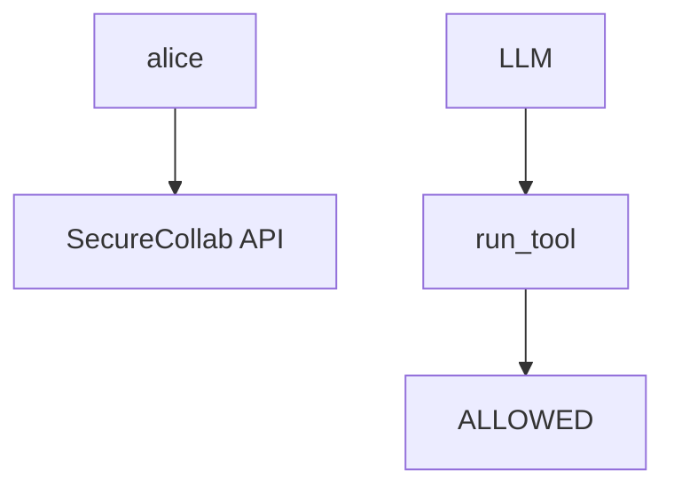
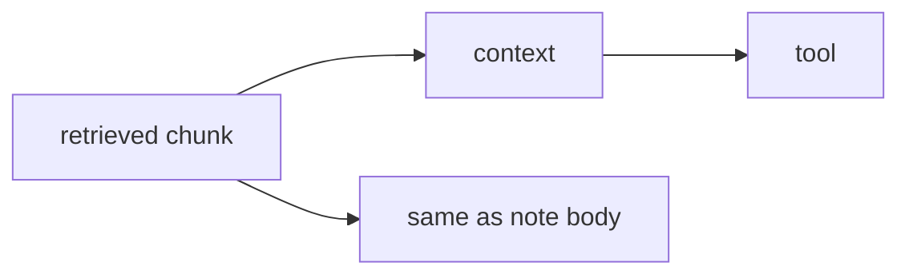

# E1-LO-02 — Tool matrix vs system prompt

**Kind:** design-exercise
**Loop step:** 2 Model
**Standards:** AISVS `v1.0-C9.5.3`, `v1.0-C9.3.7`. ASVS `v5.0.0-8.2.1`.

## Can a second engineer name the tool check from your agent map?

“The prompt says not to” is not this lesson. A reviewable model names **ALLOWED tools, who may invoke them, retrieved-doc trust, and human approval**.

SecureCollab freeze: local `run_tool(name, args)`. No live model APIs.

## Mental model: model principal versus runtime principal

The model is not alice.

## Mental model: retrieval is input

## Step 1: freeze pieces

| Piece | This system |
|---|---|
| Subjects | prompt injection; poisoned doc |
| Objects | tools; SQL interpreter |
| Actions | `run_tool` |
| Channels | note body; RAG |
| TCB | allowlist in runtime |
| Untrusted | model output; system prompt; retrieved docs |
| State / time | session; tool loop |
| 1.1 cell | authorization of tools |

## Step 2: write cells

| Subject | Object | Action | Decision |
|---|---|---|---|
| model | exec_sql | run | deny |
| model | search_notes | run | may allow |
| system prompt | exec_sql | treat as deny | deny |
| RAG chunk | policy | treat as trusted | deny |

## Practice

Draw the map. Point at `labs/E1/e1-lab` file `tools.py`.

## Transfer

Copilot in CI is the same grain with `pip install` as `exec_sql`.

## Residual risk

`v1.0-C9.2.8` Level 3 bound approvals; hallucinated packages.

## Non-goals

Top 10 as the definition of security. Keys stay out of lessons.
