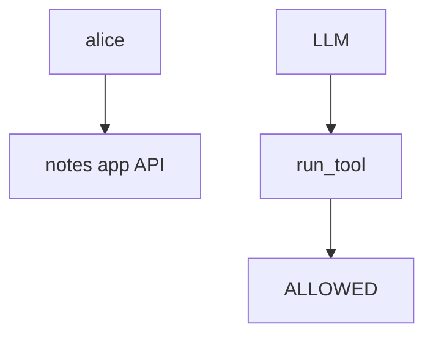
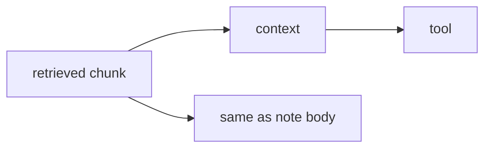

# Tool table vs system prompt

**Kind:** design-exercise
**Loop step:** 2 Model

## Could someone else name the tool check from your agent map?

"The prompt says not to" is not this lesson. A drawing someone else can test names **ALLOWED tools, who may invoke them, whether a retrieved document is trusted, and whether a human must approve**.

This week's freeze for the notes app: local `run_tool(name, args)`. No live model APIs.

> For tools, the rule is deny when the name is `exec_sql`. Allow-listed `search_notes` may run. Evidence that the deny is false: `run_tool("exec_sql", {})` returns a ran-string.

If the tool × who-may-call row is blank, the tool runs because nobody named the check.

## Picture: model principal vs runtime principal

The model is not alice.

## Picture: retrieval is input

The model's context window is not the allow-list.

## Step 1: name the pieces

Take the agent you already have and ask what would show `exec_sql` is still allowed.

| Piece | This system |
|---|---|
| Who | Prompt injection; poisoned document |
| What | Tools; SQL interpreter |
| Actions | `run_tool` |
| Paths | Note body; retrieved chunks |
| What you trust for this journey | Allow-list in the runtime |
| What you do not trust | Model output; system prompt; retrieved docs |
| Time | Session; tool loop |
| The rule | Authorization of tools |

## Step 2: write allow and deny

| Who | What | Action | Decision |
|---|---|---|---|
| model | `exec_sql` | run | deny |
| model | `search_notes` | run | may allow |
| system prompt | `exec_sql` | treat as deny | deny |
| retrieved chunk | policy | treat as trusted | deny |

A helpful prompt with `run_tool` always running is how "the model only summarizes" becomes `exec_sql`. Write the hole.

## Practice

Open `tools.py` in `labs/E1/e1-lab`.

## Use it somewhere new

A coding assistant in CI is the same rule with `pip install` as `exec_sql`.

## What can still go wrong

Cryptographically bound human approvals are extra, advanced work. Hallucinated package names stay a later leftover.

## What this page is not doing

Answer keys are not on this site.
