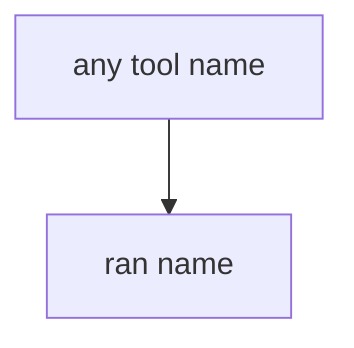

# E1-LO-03 — Observe always-run run_tool, do not call live models

**Kind:** mechanism-lab
**Loop step:** 3 Break
**Standards:** AISVS `v1.0-C9.5.3`. Lab policy: local only.

## Authorized scope

`labs/E1/e1-lab` only. Synthetic tool names. Do **not** send prompts to a public LLM, production agent, or clinic summarizer as the exercise.

**Forbidden outcome:** Agent executes `exec_sql` because the model asked.

## Mental model: any name runs



The vulnerable tree demonstrates **cause** (model output treated as policy). Do not probe public APIs.

## What to read in the fixture

`vulnerable/tools.py` returns `ran {name}` for every name. Tests require `run_tool("exec_sql")` to be `None`.

## Root cause vs impact

| Slice | Lab |
|---|---|
| Root cause | Model output treated as policy |
| Impact | SQL interpreter via English |
| Not the lesson | An LLM Top 10 product as the definition |

## Practice

```
python3 -m pytest labs/E1/e1-lab/tests --impl vulnerable
```

Record `test_exec_sql_tool_is_denied`. Do not probe public hosts.

## Transfer

Clinic summarizer: predict without leaving this directory.

## Non-goals

No live-LLM, production-agent, or public prompt-injection instructions.
