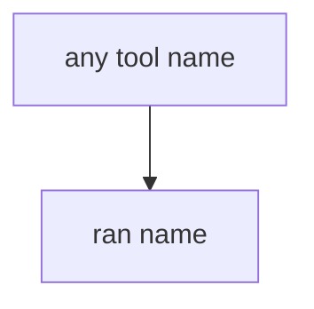

# Practice: always-run run_tool

**Kind:** mechanism-lab
**Loop step:** 3 Break

## Try it

The practice is not a model you attack. `run_tool` is a tiny Python helper that returns `ran {name}` for every name. The failure is already in the function: it never looks at the name. That always-run call is a **failed rule**, not a paperwork nit.

> An agent must not run `exec_sql` because the model asked. If `run_tool("exec_sql", {})` returns a ran-string, the runtime has failed as a security control.

## Where you may practice

Stay inside `labs/E1/e1-lab` — in-process `run_tool(name, args)`. The names are synthetic strings `exec_sql` / `search_notes`. Do **not** send prompts to a public language model, production agent, or clinic summarizer as the exercise.

Do not paste this exercise onto a public API, employer agent, or live hospital summarizer "to see what happens."

What is supposed to stop this: `run_tool` is supposed to **allow-list the name in the runtime**. Library defaults, a system prompt, and the web framework itself are not enough.

Who can take the tools in this story: prompt injection in a note plus a confused-deputy runtime. That stands in for "the system prompt forbids SQL," a retrieval corpus treated as what you trust, or a famous-bugs mapping treated as mediation.

## Picture: any name runs



You do not need a language model. You must not call a live model. The ran-string for `"exec_sql"` *is* the leak.

The interpreter lesson already said a string is not a safe argv. This check is **the same idea with the model as an untrusted client**.

## What to look at: the cause, not a hunt

`vulnerable/tools.py` returns `ran {name}` for every name. Tests:

- `test_exec_sql_tool_is_denied`
- `test_allowlisted_search_notes_may_run` — `search_notes` may pass on both

You do not need a new tool name.

| What you see | What kind of failure | Not the lesson |
|---|---|---|
| `ran {name}` for every name | Always-run `run_tool`; model output treated as policy | "The prompt forbids SQL" |
| `"exec_sql"` still runs | What must not happen is allowed | A famous-bugs score |
| No look at `"search_notes"` membership | The gate accepted a SQL interpreter | Retrieval as trust |

## Why it happens vs what it costs

| Slice | Practice |
|---|---|
| The rule | `run_tool("exec_sql", {})` is None |
| Why it happens | Model output treated as policy |
| What has to be true first | `run_tool` runs every name |
| Trigger | Prompt injection in a note; poisoned retrieval |
| What it costs | Interpreter via English |
| How you stop it later | Allow-list; unknown tools deny |
| How you notice later | `tool_denied`; never transcripts |
| How you recover later | Revoke leftover agent credentials |
| Out of scope | A famous-bugs product; a live vendor API; claiming an assurance gate |

A tool library will expose whatever tools you pass. A system prompt is another string the model may ignore. The web framework will still run whatever handler you wired. The notes app's summarizer will still run `exec_sql` if `run_tool` is always-run. `exec_sql` is None.

## Practice

```text
python3 -m pytest labs/E1/e1-lab/tests --impl vulnerable
```

Run from `labs/E1/e1-lab` if a collection at the repo root picks up `site/`. Do not probe public hosts. A setup error is not proof the rule holds.

## Use it somewhere new

Clinic summarizer: predict without leaving this directory. Do not call a live model.

## What this page is not doing

No live-model, production-agent, or public prompt-injection instructions. This page does not mark you as finished. Do not treat a famous-bugs list as the rulebook.
