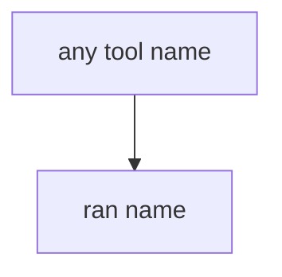

# E1-LO-03 — Observe always-run run_tool, do not call live models

**Kind:** mechanism-lab
**Loop step:** 3 Break
**Standards:** OWASP AISVS 1.0 (final) `v1.0-C9.5.3`. `v1.0-C9.2.8` cryptographically bound approvals is **Level 3, advanced**. ASVS `v5.0.0-8.2.1`. LLM Top 10 2026 LLM03 is **awareness after** the cause. Lab policy: local only.

## Authorized scope

`labs/E1/e1-lab` only. The fixture is an in-process `run_tool(name, args)`. Synthetic tool names. Do **not** send prompts to a public LLM, production agent, or clinic summarizer as the exercise.

**Forbidden outcome:** Agent executes `exec_sql` because the model asked. `run_tool("exec_sql", {})` returns a ran-string instead of `None`.

Attacker capability in this lab: prompt injection in a note plus a confused-deputy runtime. That stands in for “the system prompt forbids SQL,” a RAG corpus treated as TCB, or an LLM03 mapping treated as 1.2. Trust assumption: `run_tool` is supposed to **allowlist the name in the runtime**. LangChain defaults, a system prompt, and FastAPI are not in the TCB for this cell.

## Mental model: any name runs



The vulnerable tree demonstrates **cause** (model output treated as policy). Do not probe public APIs. Preconditions: `run_tool` returns `ran {name}` for every name. You do not need an LLM. You must not call a live model.

AISVS `v1.0-C9.5.3` wants access-control decisions enforced by application logic, **never by the AI model**. Module 6.1 already said interpreters need argv shape; this cell is **the model is an untrusted client (8.1)**. Gate 7 and M2 stay **not-attempted**. Electives open after Phase 7; they do not stamp it.

## What to read in the fixture

`vulnerable/tools.py` returns `ran {name}` for every name. Tests:

- `test_exec_sql_tool_is_denied`
- `test_allowlisted_search_notes_may_run` — `search_notes` may pass on both

You do not need a new tool name. The failure of `test_exec_sql_tool_is_denied` *is* the evidence.

Do not open the fixed tree yet. Diagnose the cause first.

## Root cause vs impact vs prevention vs detection vs recovery

| Slice | This lab |
|---|---|
| Required property | `run_tool("exec_sql", {})` is None |
| Root cause | Model output treated as policy |
| Preconditions | `run_tool` runs every name |
| Trigger | Prompt injection in a note; poisoned retrieval |
| Impact | Interpreter via English; 6.1 + 1.2 |
| Prevention | Allowlist; unknown tools deny |
| Detection | `tool_denied`; never transcripts |
| Recovery | Revoke agent creds (7.4) |
| Not the lesson | An LLM Top 10 product; live OpenAI; Gate 7 complete |

## Framework defaults versus the tool guarantee

LangChain will expose whatever tools you pass. A system prompt is another string the model may ignore. FastAPI will run whatever handler you wired. The application guarantee is: **this** fixture, `exec_sql` is None.

## Practice

```text
python3 -m pytest labs/E1/e1-lab/tests --impl vulnerable
```

Run from `labs/E1/e1-lab` if a repo-root collection picks up `site/`. Record `test_exec_sql_tool_is_denied`. Do not probe public hosts. An environment error is not security evidence.

## Transfer

Clinic summarizer: predict without leaving this directory. Do not call a live LLM.

## Non-goals

No live-LLM, production-agent, or public prompt-injection instructions. Do not claim Gate 7. LLM03 stays awareness after the cause. AISVS is not ASVS.
