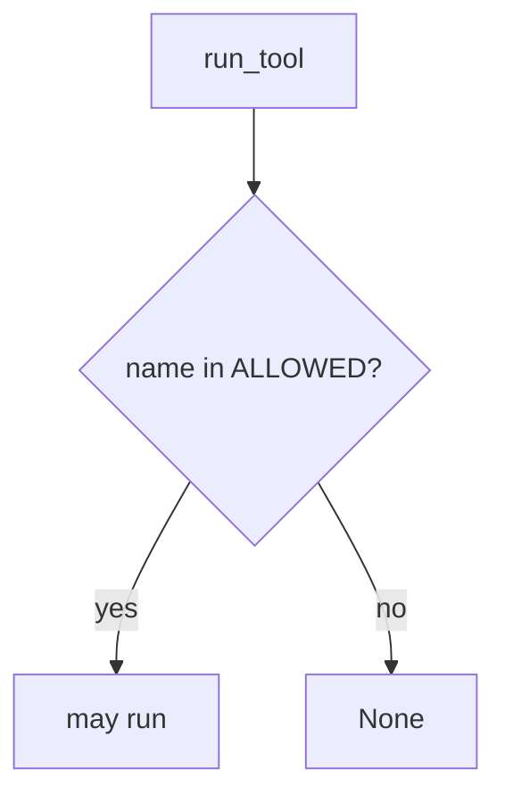

# E1-LO-04 — Allowlist tools in the runtime

**Kind:** design-exercise
**Loop step:** 4 Build
**Standards:** AISVS 1.0 (final) `v1.0-C9.5.3`, `v1.0-C9.3.7`. ASVS `v5.0.0-8.2.1`.

## Structural means the runtime compares the name

`run_tool` must return `None` unless `name in ALLOWED`. Fail-safe: unknown tools deny. A system prompt may *accompany* the allowlist; it does not replace it.

## Mental model: tool-name allowlist gate



Do not accept “the prompt forbids it” as membership.

## Why this restores the cell

| After the fix | Must be true |
|---|---|
| exec_sql | None |
| search_notes | ran search_notes |

## What this is not

LangChain. LLM03 dashboard. Gate 7 / M2. Human-approval crypto (`v1.0-C9.2.8` Level 3 residual).

## Practice

Name who can edit ALLOWED. Run:

```
python3 -m pytest labs/E1/e1-lab/tests --impl fixed
```

Must pass.

## Transfer

Copilot: deny `pip install` / shell tools in CI the same way.

## Residual risk

Allowlisted tool returns HTML; hallucinated packages; `v1.0-C9.2.8` Level 3.
