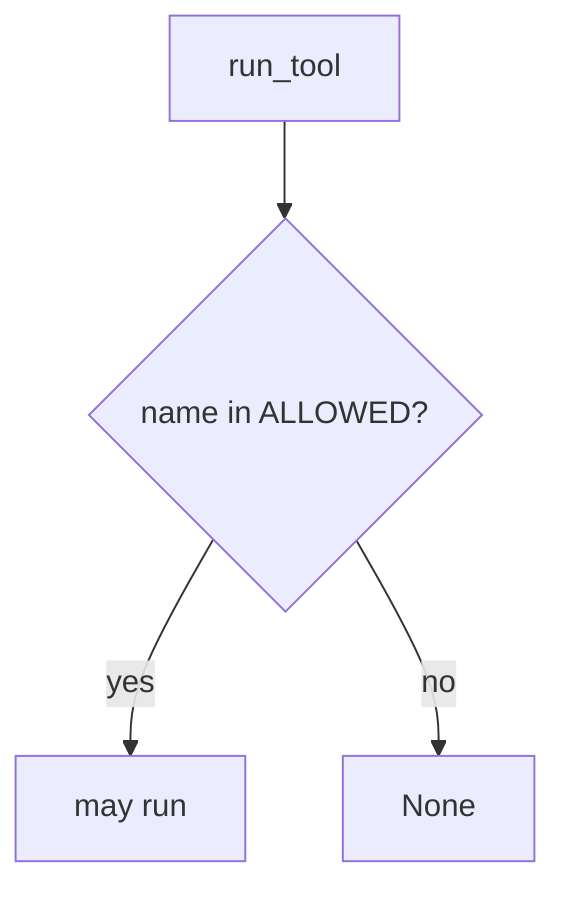

# E1-LO-04 — Allowlist tools in the runtime

**Kind:** design-exercise
**Loop step:** 4 Build
**Standards:** AISVS 1.0 (final) `v1.0-C9.5.3`, `v1.0-C9.3.7`. ASVS `v5.0.0-8.2.1`. `v1.0-C9.2.8` is **Level 3, advanced**.

## Structural means the runtime compares the name

`run_tool` must return `None` unless `name in ALLOWED`. Fail-safe: unknown tools deny. A system prompt may *accompany* the allowlist; it does not replace it. Structural means that membership — not “the prompt forbids SQL,” not RAG, not an LLM03 mapping.

The smallest restore for SecureCollab’s optional summarizer is: `exec_sql` → None, `search_notes` may run. Do not fail open because the model “only summarizes.” Do not add `exec_sql` to `ALLOWED` “for debugging.”

## Mental model: tool-name allowlist gate



Do not accept “the prompt forbids it” as membership. Production still needs allowlisted tools to be *safe* — `search_notes` that returns raw HTML is a 6.2 residual. Copilot in CI that can `pip install` is the same allowlist grain on a different object. `v1.0-C9.2.8` (cryptographically bound approvals) is Level 3 advanced: a human click is not this pytest.

AISVS `v1.0-C9.3.7` wants an allow-list before invoke. This pytest is that sentence for `exec_sql`.

## Why this restores the cell

| After the fix | Must be true |
|---|---|
| exec_sql | None |
| search_notes | ran search_notes |

## What this is not

LangChain. LLM03 dashboard. Gate 7 / M2. Human-approval crypto (`v1.0-C9.2.8` Level 3 residual). A system prompt. NIST AI 600-1 as the oracle.

## Mechanism limits

- Allowlisted `search_notes` can still return HTML (6.2).
- Hallucinated packages in Copilot remain 10.2.
- `v1.0-C9.2.8` Level 3 bound approvals are not this predicate.
- Agent credentials still need rotation (`v1.0-C9.4.3` if cited as residual).
- Retrieved chunks are untrusted clients.

## Practice

Name who can edit ALLOWED. Run:

```text
python3 -m pytest labs/E1/e1-lab/tests --impl fixed
```

Must pass. Run from the lab directory if collection at repo root is polluted.

## Transfer

Copilot: deny shell / install tools in CI the same way — runtime allowlist, not a prompt.

## Residual risk

Allowlisted tool returns HTML; hallucinated packages; `v1.0-C9.2.8` Level 3.

## Non-goals

Do not call a live model. Do not claim Gate 7 from an LLM03 screenshot. Do not present AISVS as ASVS.
