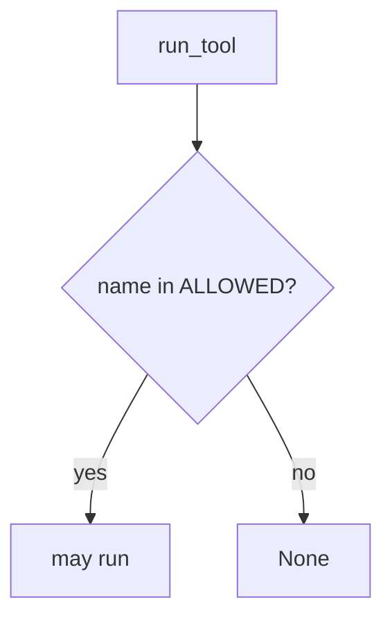

# Allow-list tools in the runtime

**Kind:** design-exercise
**Loop step:** 4 Build

## The rule

A system prompt does not block `exec_sql`. Retrieval does not block it. Mapping a famous-bugs list is a spreadsheet, not `run_tool`.

Change this: `run_tool` **returns `None` unless `name in ALLOWED`**. Fail-safe: unknown tools deny. A denylist of the string `exec_sql` would still be every-other-interpreter. Read it as that membership — not "the prompt forbids SQL," not retrieval, not a famous-bugs mapping.

The lab allow-list is a **stand-in** for runtime membership before invoke. It is not a production agent product. For the notes app's optional summarizer: `exec_sql` → None, `search_notes` may run. Fail-safe: if you are unsure whether the name is allow-listed, deny. Do not count it as a pass because the model "only summarizes." Do not add `exec_sql` to `ALLOWED` "for debugging."

## Picture: tool-name allow-list gate



`run_tool` has to sit in `{"search_notes"}`. A `search_notes` that returns raw HTML is still a lying encoding leftover. A coding assistant in CI that can `pip install` is the same allow-list grain on a different object. Cryptographically bound human approvals are extra, advanced work: a human click does not take `exec_sql` off always-run.

Use an allow-list before a tool runs — `exec_sql`.

## What the repaired files must show

Do not treat `fixed/tools.py` as a production agent product.

| After the fix | Must be true |
|---|---|
| `exec_sql` | None |
| `search_notes` | ran search_notes |

Unless you know otherwise, if you are unsure whether the name is allow-listed, deny. A careful-looking prompt does not make it a run.

## What this is not

- A system prompt.
- Retrieval as trust.
- A famous-bugs dashboard.
- An LLM-dashboard tile treated as done.
- Cryptographically bound approvals (extra, advanced leftover).
- Library defaults.
- A guidance document as the check.

## What the tool cannot do

- Allow-listed `search_notes` can still return HTML.
- Hallucinated package names in a coding assistant stay a later leftover.
- Cryptographically bound approvals are not this predicate.
- Agent credentials still need rotation.
- Retrieved chunks are untrusted clients.

## Practice

Name who can edit `ALLOWED`. Run:

```text
python3 -m pytest labs/E1/e1-lab/tests --impl fixed
```

## Use it somewhere new

Coding assistant: deny shell / install tools in CI the same way — runtime allow-list, not a prompt.

## What can still go wrong

Allow-listed tool returns HTML. Hallucinated packages. Cryptographically bound approvals (extra, advanced). Leftover agent credentials.

## What this page is not doing

Do not call a live model. This page does not mark you as finished. A famous-bugs screenshot is not a check-in. Do not present a system prompt as the allow-list.
