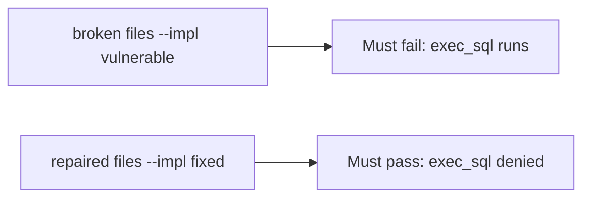

# A broken runtime must fail the check

**Kind:** verification-lab
**Loop step:** 5 Verify

## Until you can fail it, it is still a slogan

"We use retrieval" is not evidence. "The prompt forbids SQL" is a tool observation. The check is: `run_tool("exec_sql", {})` is None and `search_notes` may run. That `exec_sql` observation must be **false** on the broken files and **true** on the repaired files. Do not call live models.

## Picture: a broken runtime must fail the check

A check that only counts passing tests can still look green while `run_tool("exec_sql", {})` still returns a ran-string.



If both pass, the test is not looking at `exec_sql`. If both fail, the fix is not structural or the check is wrong.

## What the check has to show

| Mode | Must show for this topic |
|---|---|
| Normal | `search_notes` → may run (may pass on both) |
| Wrong input | `exec_sql` → None; broken files must fail |
| Abuse | Unknown tools still deny (fail closed) |
| Not claimed | A live vendor API; a famous-bugs dashboard; an assurance gate; that `search_notes` is encoded |

The file is `labs/E1/e1-lab/tests/test_property.py`. The test `test_exec_sql_tool_is_denied` is there so always-run `run_tool` cannot sneak through.

Honest `search_notes` may pass on both implementations. That does not excuse the `exec_sql` deny test. If the broken files do not fail `test_exec_sql_tool_is_denied`, the lab is miswired — fix the wiring, not the assertion.

```text
python3 -m pytest labs/E1/e1-lab/tests --impl vulnerable
python3 -m pytest labs/E1/e1-lab/tests --impl fixed
```

A test that only greps `exec_sql` in a prompt file without calling `run_tool("exec_sql", {})` is not this topic's evidence. This practice never opens a live model.

## What the tests do not prove

- Retrieved chunks are encoded
- Agent credentials rotate
- A coding assistant cannot hallucinate packages
- Cryptographically bound approvals (extra, advanced)
- An assurance gate complete

Record those as leftover or later topics, not as silent passes.

## Practice

Run both this session from the lab directory if needed:

```text
python3 -m pytest labs/E1/e1-lab/tests --impl vulnerable
python3 -m pytest labs/E1/e1-lab/tests --impl fixed
```

Paste nothing from answer keys. Write fail/pass into your notes next to the `exec_sql` row. Reject a "test" that only greps `exec_sql` in a prompt file without calling `run_tool("exec_sql", {})`.

## Use it somewhere new

A clinic example: a test that only asserts "the prompt mentions `exec_sql`" is not this topic. A live vendor tenant is out of scope.

## What this page is not doing

Do not treat a live model screenshot as proof. Do not log transcripts. Answer keys are not on this site. This page does not mark you as finished.
