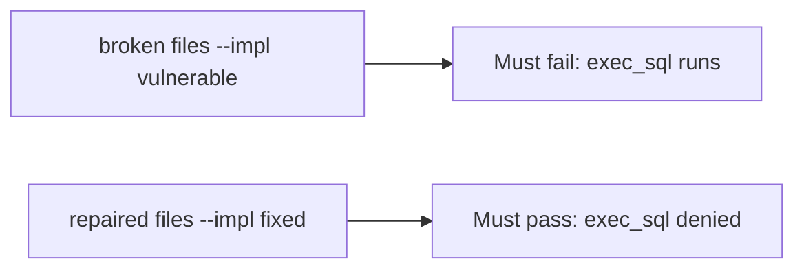

# A broken runtime must fail the check

**Kind:** verification-lab
**Loop step:** 5 Verify

## Check it

Turning on retrieval does not block `exec_sql`. A prompt that forbids SQL is a string. `run_tool("exec_sql", {})` has to be None, and `search_notes` may run. Vulnerable files: `exec_sql` still runs. Repair stops that tool from running. Do not call live models.

## Picture: a broken runtime must fail the check

`run_tool("exec_sql", {})` can still return a ran-string even when tests pass.



If the broken tool gate still passes, `exec_sql` was never denied.

## What the check has to show

| Mode | Must show for this topic |
|---|---|
| Normal | `search_notes` → may run (may pass on both) |
| Wrong input | `exec_sql` → None; broken files must fail |
| Abuse | Unknown tools still deny (fail closed) |
| Not claimed | A live vendor API; a famous-bugs dashboard; a check-in; that `search_notes` is encoded |

The test `test_exec_sql_tool_is_denied` is there so always-run `run_tool` still fails.

Keep `search_notes`. Deny `exec_sql`. If the broken files do not fail `test_exec_sql_tool_is_denied`, the lab is miswired — fix the wiring, not the assertion.

```text
python3 -m pytest labs/E1/e1-lab/tests --impl vulnerable
python3 -m pytest labs/E1/e1-lab/tests --impl fixed
```

An `exec_sql` string in a prompt file is not `run_tool("exec_sql", {})`. This practice never opens a live model.

## What the tests do not prove

- Retrieved chunks are encoded
- Agent credentials rotate
- A coding assistant cannot hallucinate packages
- Cryptographically bound approvals (extra, advanced)
- This page does not finish an AI-tooling check-in

## Practice

Call `run_tool("exec_sql", {})`. An `exec_sql` string in a prompt file is the forbid-text, not the block.

## Use it somewhere new

A prompt that mentions `exec_sql` is the forbid-text, not `run_tool`. Do not use a live vendor tenant.

## What this page is not doing

A live model screenshot is not `run_tool` denying `exec_sql`. Do not log transcripts. Answer keys are not on this site. This page does not mark you as finished.
