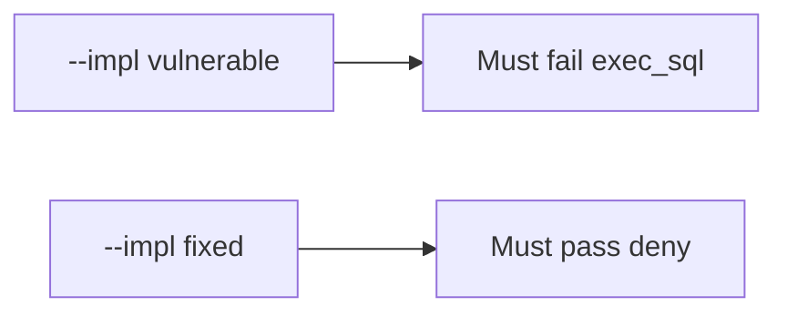

# E1-LO-05 — Evidence is exec_sql denied, then a passing pair

**Kind:** verification-lab
**Loop step:** 5 Verify
**Standards:** AISVS `v1.0-C9.5.3`. ASVS `v5.0.0-8.2.1` as mediation vocabulary, not the AISVS id.

## An invariant that cannot fail a test is still a slogan

“We use RAG” is not evidence. “The prompt forbids SQL” is a mechanism observation. The oracle is: `run_tool("exec_sql", {})` is None and `search_notes` may run. The exec_sql observation must be **false** on `--impl vulnerable` (returns a ran-string) and **true** on `--impl fixed`. Do not call live models.

## Mental model: vulnerable must fail: exec_sql

The failing observation on `--impl vulnerable` is **exec_sql**. A passing collection count is not this cell.



| Mode | Must show for this module |
|---|---|
| Negative / abuse | exec_sql → None; vulnerable must fail |
| Normal | search_notes → may run (may pass on both) |
| Not claimed | live OpenAI; LLM03 dashboard; Gate 7; that search_notes is encoded |

Lab tests in `labs/E1/e1-lab/tests/test_property.py`. `test_exec_sql_tool_is_denied` is a **forbidden-outcome** test: always-run `run_tool` is not allowed to count as a passing control.

```text
python3 -m pytest labs/E1/e1-lab/tests --impl vulnerable
python3 -m pytest labs/E1/e1-lab/tests --impl fixed
```

Honest `search_notes` may pass on both implementations. That does not excuse the exec_sql deny test. If vulnerable does not fail `test_exec_sql_tool_is_denied`, the lab is miswired—fix the wiring, not the assertion.

## What the tests do not prove

- Retrieved chunks are encoded (6.2)
- Agent credentials rotate
- Copilot cannot hallucinate packages (10.2)
- `v1.0-C9.2.8` Level 3 bound approvals
- Gate 7 / M2 complete

Record those as residuals or later modules, not as silent passes.

## Practice

Execute both implementations this session from the lab directory if needed. Write the fail/pass pair next to the matrix row. Reject a “test” that only greps `exec_sql` in a prompt file without calling `run_tool("exec_sql", {})`.

## Transfer

Clinic: a test that only asserts “the prompt mentions exec_sql” is not this cell. A live OpenAI tenant is out of scope.

## Non-goals

Do not add a live-LLM trophy. Do not log transcripts. Keys stay out of this file. Gate 7 stays not-attempted.
