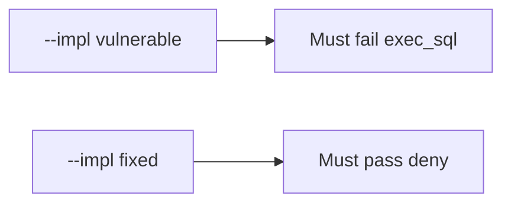

# E1-LO-05 — Evidence is exec_sql denied, then a passing pair

**Kind:** verification-lab
**Loop step:** 5 Verify
**Standards:** AISVS `v1.0-C9.5.3`.

## An invariant that cannot fail a test is still a slogan

“We use RAG” is not evidence. The oracle is the local pair. Do not call live models.

## Mental model: fail-on-vulnerable, pass-on-fixed



| Case | Must show |
|---|---|
| Negative / abuse | exec_sql → None |
| Normal | search_notes → may run |
| Not claimed | live OpenAI; LLM03 dashboard; Gate 7 |

```
python3 -m pytest labs/E1/e1-lab/tests --impl vulnerable
python3 -m pytest labs/E1/e1-lab/tests --impl fixed
```

Honest `search_notes` may pass on both.

## What the tests do not prove

- Retrieved chunks are encoded (6.2)
- Agent credentials rotate (AISVS `v1.0-C9.4.3` Level 3)
- Copilot cannot hallucinate packages

## Practice

Execute both implementations. Map each test to an LO-02 cell.

## Transfer

Clinic: a test that only asserts “the prompt mentions exec_sql” is not this cell.
