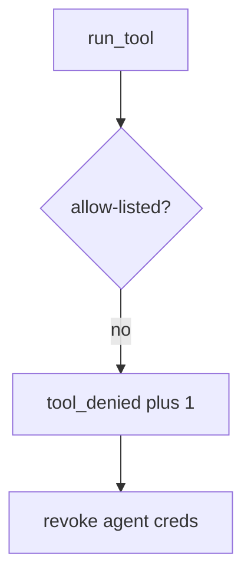

# Log the denied tool, not the transcript

**Kind:** operations-exercise
**Loop step:** 6 Operate

## Fixing it once is not enough

A new tool can still be registered outside the allow-list. Keep note bodies, full model transcripts, and the prompt out of the ticket.

## Picture: denied tool is a signal

If a tool is denied, page the tool name — not the transcript. Then revoke leftover agent credentials.



A vendor product does not make the tool gate an allow-list.

`test_exec_sql_tool_is_denied` still has to catch `exec_sql` on always-run. A prompt that “forbids SQL” does not deny `exec_sql`. Coding-assistant install tools in CI still run unconstrained; the allow-list is not done until those tools are named.

## Signals that do not become a second leak

| Outcome | This topic |
|---|---|
| Notice | `tool_denied` |
| What the line holds | Tool name, agent id; **never** bodies |
| Respond | Stop the registration that added `exec_sql`; do not paste the prompt into chat |
| Recover | Revoke leftover agent credentials |
| Leftover | Prompt-only policy; hallucinated packages; HTML from `search_notes` |

Agent token counts do not mean CI's `run_tool` refused `exec_sql`. Detection must observe **`exec_sql` is None**, not "the model is on-policy." The metric is `exec_sql` is None. A transcript or a note body is the model output.

```text
log_denied reason=tool_denied agent=sum-1 tool=exec_sql
```

A note body, a transcript, or "check-in complete" in the tool-deny sample is another model dump.

Quote the tool name in the ticket. Quoting the transcript hands the model output to whoever is on call.

## What the framework does vs what you still have to check

Lying `search_notes` HTML, unconstrained installs, and prompt-only policy still run even if the agent dashboard is green.

Cause first: model output treated as policy. Then an interpreter via English. Put the allow-list in. Watch `tool_denied`. Recover by revoking leftover agent credentials. The page does not encode `search_notes` HTML, and it does not stop hallucinated packages.

## Can people still use it

A denied tool must say *exec_sql not allow-listed*, not only "assert False." Do not encode that reason as color only. If a human-approval screen exists, operators must not auto-approve.

## Practice

```text
log_denied reason=tool_denied agent=sum-1 tool=exec_sql
```

A note body, a transcript, or "check-in complete" in the log is the model output twice.

## Use it somewhere new

Deny the chart-SQL tool; do not paste the prompt into the ticket. Do not call a live model.

## What this page is not doing

This page does not mark you as finished. A famous-bugs label does not deny `exec_sql`. Answer keys are not on this site.
