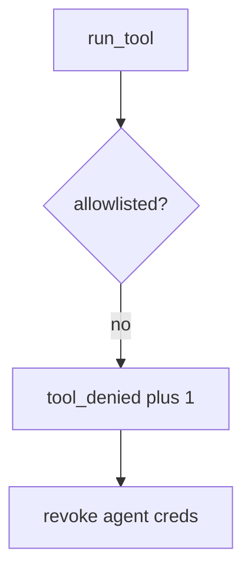

# E1-LO-06 — Detect tool_denied without logging transcripts

**Kind:** operations-exercise
**Loop step:** 6 Operate
**Standards:** NIST CSF 2.0 (final) DE/RS/RC as outcome labels; AISVS `v1.0-C9.5.3`. ASVS `v5.0.0-8.2.1`.

## Prevention is not absolute

A new tool can be registered after the allowlist was “set once.” Pair detect and recover. Do not log note bodies or full model transcripts (3.1 / 8.5). Do not paste the prompt into the ticket.

## Mental model: denied tool is a signal



| Outcome | This module |
|---|---|
| Detect | `tool_denied` |
| Signal | tool name, agent id; never bodies |
| Recover | Revoke agent creds (7.4) |
| Residual | Prompt-only policy; hallucinated packages; HTML from search_notes |

CSF 2.0 Detect / Respond / Recover name outcomes. They do not prove `v1.0-C9.5.3`. An LLM-vendor name is not the property. Re-run `test_exec_sql_tool_is_denied` after any tool-registration change; a green “prompt forbids SQL” tile is not that pytest. Copilot install-tools in CI are the same family — inventory them before claiming Recover.

## Framework defaults versus the operate guarantee

A vendor agent dashboard will show token counts and stay silent when CI’s `run_tool` is always-run. Detection must observe **exec_sql is None**, not “the model is on-policy.” If the alert includes a transcript or a note body, you have opened a 3.1 / 8.5 cell.

## Practice

Write one log line you would accept. Tie it to `labs/E1/e1-lab`.

```text
log_denied reason=tool_denied agent=sum-1 tool=exec_sql
```

Reject any line that includes a note body, a transcript, or “Gate 7 complete.”

## Transfer

Clinic: deny the chart-SQL tool; do not paste the prompt into the ticket. Do not call a live LLM.

## Usability

A denied tool must say *exec_sql not allowlisted*, not only “assert False” (WCAG 2.2 Success Criterion 4.1.3). If a human-approval UI exists, operators must not auto-approve (`v1.0-C9.2.8` residual).

Cause vs impact stays split here too: the **cause** is model output treated as policy; the **impact** is an interpreter via English; **prevention** is the allowlist; **detection** is `tool_denied`; **recovery** is revoke agent creds. Mechanism limit: this alert does not encode `search_notes` HTML and does not stop hallucinated packages.

## Non-goals

An LLM-vendor name is not the property. M2 stays not-attempted. LLM03 is not this alert.
