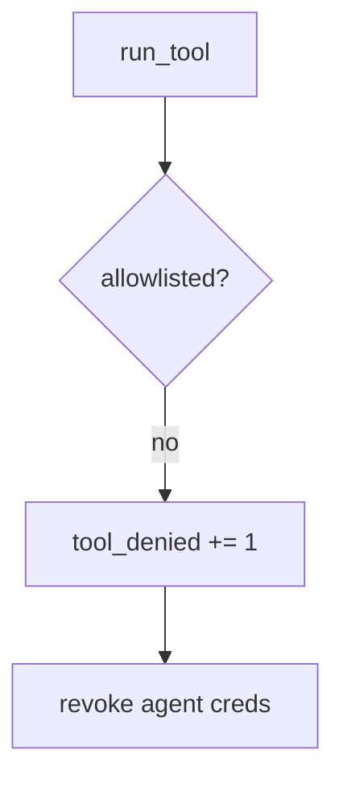

# E1-LO-06 — Detect tool_denied without logging transcripts

**Kind:** operations-exercise
**Loop step:** 6 Operate
**Standards:** NIST CSF 2.0 (final) DE/RS/RC as outcome labels; AISVS `v1.0-C9.5.3`.

## Prevention is not absolute

A new tool can be registered after the allowlist was “set once.” Pair detect and recover. Do not log note bodies or full model transcripts (3.1 / 8.5).

## Mental model: denied tool is a signal



| Outcome | This module |
|---|---|
| Detect | `tool_denied` |
| Signal | tool name, agent id; never bodies |
| Recover | Revoke agent creds (7.4) |
| Residual | Prompt-only policy; hallucinated packages |

## Practice

Write one log line you would accept. Tie it to `labs/E1/e1-lab`.

```
log_denied reason=tool_denied agent=sum-1 tool=exec_sql
```

Reject any line that includes a note body, a transcript, or “Gate 7 complete.”

## Transfer

Clinic: deny the chart-SQL tool; do not paste the prompt into the ticket.

## Non-goals

An LLM-vendor name is not the property. M2 stays not-attempted.
