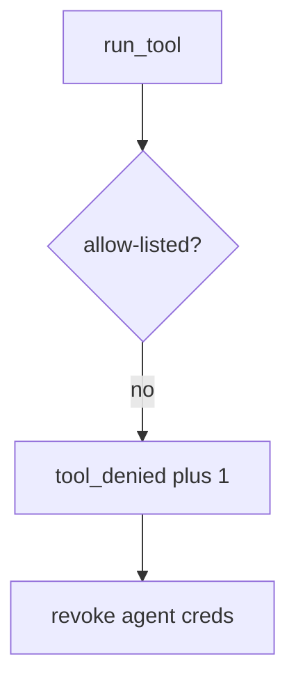

# Log the denied tool, not the transcript

**Kind:** operations-exercise
**Loop step:** 6 Operate

## Fixing it once is not enough

A new tool can still be registered after the allow-list was "set once." Do not log note bodies or full model transcripts. Do not paste the prompt into the ticket.

## Picture: denied tool is a signal

A denied tool is a notice-and-recover problem, not a licence to quote a transcript in the paging channel. Notice names the tool. Recover revokes leftover agent credentials. Neither reprints the note body.



A vendor product is not the rule, and calling the tool gate an allow-list is not proof.

Re-run `test_exec_sql_tool_is_denied` after any tool-registration change. A green "prompt forbids SQL" tile is not that check. Coding-assistant install tools in CI are the same family — inventory them before you claim recover.

## Signals that do not become a second leak

| Outcome | This topic |
|---|---|
| Notice | `tool_denied` |
| What the line holds | Tool name, agent id; **never** bodies |
| Respond | Stop the registration that added `exec_sql`; do not paste the prompt into chat |
| Recover | Revoke leftover agent credentials |
| Leftover | Prompt-only policy; hallucinated packages; HTML from `search_notes` |

A vendor agent dashboard will show token counts and stay silent when CI's `run_tool` is always-run. Detection must observe **`exec_sql` is None**, not "the model is on-policy." If the alert includes a transcript or a note body, you have opened a leftover-secret leak.

```text
log_denied reason=tool_denied agent=sum-1 tool=exec_sql
```

Not: a note body, a transcript, or "assurance gate complete."

If your alert includes the matching transcript, you have copied the leak into the paging channel.

## What the framework does vs what you still have to check

The same lying `search_notes` HTML, hallucinated packages, and prompt-only policy that bypass this practice will also bypass a "scan our agent dashboard" detector. Name those places before you claim recover. A vendor name is not this week's rule.

Cause vs cost stays split here too: the **cause** is model output treated as policy; the **cost** is an interpreter via English; **how you stop it** is the allow-list; **how you notice** is `tool_denied`; **how you recover** is revoke leftover agent credentials. What the tool cannot do: this alert does not encode `search_notes` HTML, and it does not stop hallucinated packages.

## Can people still use it

A denied tool must say *exec_sql not allow-listed*, not only "assert False." Do not encode that reason as color only. If a human-approval screen exists, operators must not auto-approve.

## Practice

For `labs/E1/e1-lab`, write a log line you would accept.

```text
log_denied reason=tool_denied agent=sum-1 tool=exec_sql
```

Reject any line that includes a note body, a transcript, or "assurance gate complete."

## Use it somewhere new

A clinic example: deny the chart-SQL tool; do not paste the prompt into the ticket. Do not call a live model.

## What this page is not doing

This page does not mark you as finished. A famous-bugs label is not this alert. Answer keys are not on this site.
